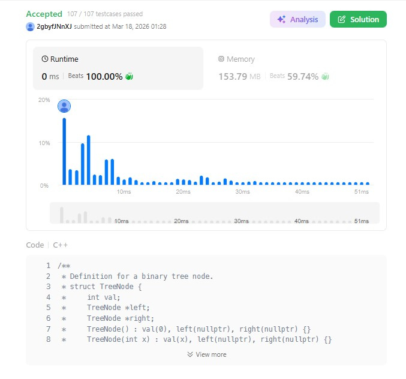

# 1609. Even Odd Tree

### 題目說明
檢查二元樹是否符合「奇偶樹」規則：
- 偶數層：節點值為奇數且嚴格遞增。
- 奇數層：節點值為偶數且嚴格遞減。

### 程式碼實作 (C++)
```cpp
/**
 * Definition for a binary tree node.
 * struct TreeNode {
 * int val;
 * TreeNode *left;
 * TreeNode *right;
 * TreeNode() : val(0), left(nullptr), right(nullptr) {}
 * TreeNode(int x) : val(x), left(nullptr), right(nullptr) {}
 * TreeNode(int x, TreeNode *left, TreeNode *right) : val(x), left(left), right(right) {}
 * };
 */
class Solution {
public:
    bool isEvenOddTree(TreeNode* root) {
        queue<TreeNode*> q;
        q.push(root);

        int level = 0;

        while(!q.empty()){
            int size = q.size();
            int prev = (level % 2 == 0) ? INT_MIN : INT_MAX;

            for(int i = 0; i < size; ++i){
                TreeNode* node = q.front(); 
                q.pop();

                if (level % 2 == 0){
                    // even level : odd and strictly increasing
                    if (node->val % 2 == 0 || node->val <= prev) return false;
                }
                else{
                    // odd level : even and strictly decreasing
                    if (node->val % 2 != 0 || node->val >= prev) return false;
                }

                prev = node->val;

                if (node->left) q.push(node->left);
                if (node->right) q.push(node->right);
            }
            level++;
        }
        return true;
    }
};
```

