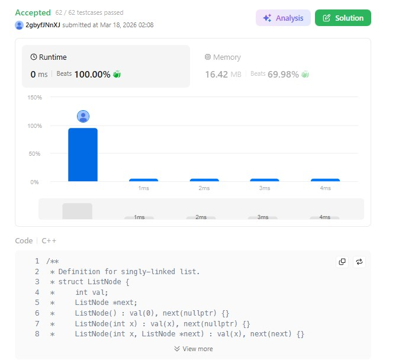

# 25. Reverse Nodes in k-Group (Hard)

### 題目說明
將Linked List每 k 個節點進行翻轉。若最後剩餘節點不足 k 個，則保持原樣。

### 程式碼實作 (C++)
```cpp
/**
 * Definition for singly-linked list.
 * struct ListNode {
 *     int val;
 *     ListNode *next;
 *     ListNode() : val(0), next(nullptr) {}
 *     ListNode(int x) : val(x), next(nullptr) {}
 *     ListNode(int x, ListNode *next) : val(x), next(next) {}
 * };
 */
class Solution {
public:
    ListNode* reverseKGroup(ListNode* head, int k) {
        ListNode* cur = head;

        for(int i = 0; i < k; ++i){
            if (!cur) return head;
            cur = cur->next;
        }

        ListNode* prev = nullptr;
        cur = head;

        for(int i = 0; i < k; ++i){
            ListNode* nextNode = cur->next;
            cur->next = prev;
            prev = cur;
            cur = nextNode;
        }

        if (cur){
            head->next = reverseKGroup(cur, k);
        }
        return prev;
    }
};
```
