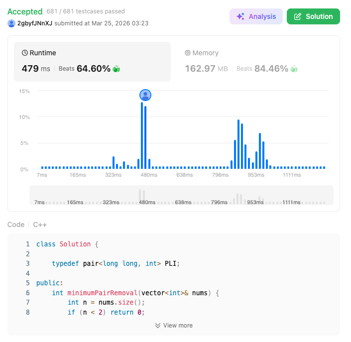

# 3510. Minimum Pair Removal to Sort Array II (Hard)

### 題目說明
- 每次合併相鄰且和最小的 Pair。
- 目標：最小化操作次數使數組非遞減 (Non-decreasing)。
- 優化關鍵：$ N=10^5 $，需使用 Heap + DLL 優化至 $O(N \log N)$。

### 程式碼實作 (C++)
```cpp
class Solution {

    typedef pair<long long, int> PLI;

public:
    int minimumPairRemoval(vector<int>& nums) {
        int n = nums.size();
        if (n < 2) return 0;

        vector<long long> val(n);
        vector<int> prev(n), next(n);
        vector<bool> removed(n, false);

        for(int i = 0; i < n; ++i){
            val[i] = nums[i];
            prev[i] = i - 1;
            next[i] = i + 1;
        }

        next[n - 1] = -1;

        priority_queue<PLI, vector<PLI>, greater<PLI>> pq;

        int decreasing_pairs = 0;

        auto is_decreasing = [&](int i){
            if (i == -1 || next[i] == -1) return false;
            return val[i] > val[next[i]];
        };

        for (int i = 0; i < n - 1; ++i){
            pq.push({val[i] + val[i + 1], i});
            if (is_decreasing(i)) decreasing_pairs++;
        }

        int operations = 0;

        while(decreasing_pairs > 0 && !pq.empty()){
            auto [sum, i] = pq.top();pq.pop();

            if (removed[i] || next[i] == -1 || (val[i] + val[next[i]] != sum)){
                continue;
            }

            int j = next[i];
            if (is_decreasing(prev[i])) decreasing_pairs--;
            if (is_decreasing(i)) decreasing_pairs--;
            if (is_decreasing(j)) decreasing_pairs--;

            val[i] = sum;
            removed[j] = true;
            next[i] = next[j];
            if (next[j] != -1) prev[next[j]] = i;

            if (is_decreasing(prev[i])) decreasing_pairs++;
            if (is_decreasing(i)) decreasing_pairs++;

            if (prev[i] != -1) pq.push({val[prev[i]] + val[i], prev[i]});
            if (next[i] != -1) pq.push({val[i] + val[next[i]], i});

            operations++;
        }

        return operations;
    }
};
```

