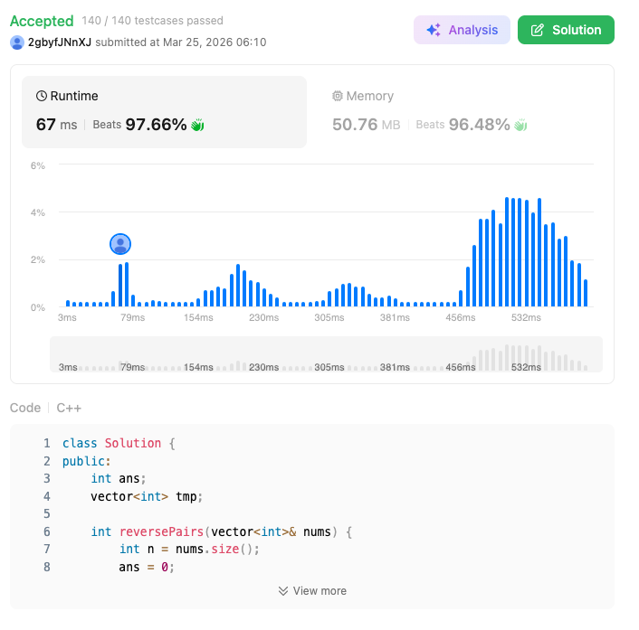

# 493. Reverse Pairs (Hard)

### 題目說明
給定一個陣列 `nums`，若滿足 $i < j$ 且 $nums[i] > 2 \times nums[j]$，則稱為一個重要翻轉對。求總共有多少個這樣的數對。

### 解題邏輯：CDQ 分治 (Merge Sort Based)
本題利用 Merge Sort 的特性，在合併兩個已排序子陣列之前進行統計。
1. **分治 (Divide)**：將問題拆解為左右子區間，遞迴處理。
2. **統計 (Counting)**：利用左右區間皆已具備「單調遞增」的特性，使用雙指標 (Two Pointers) 在 $O(n)$ 時間內計算符合條件的數對。
3. **合併 (Merge)**：執行標準排序合併，為上一層的統計做準備。

### 複雜度分析
- **時間複雜度**： $O(n\log n)$。類似 Merge Sort 的結構，每一層統計與合併皆為 $O(n)$，總共有 $\log n$ 層。
- **空間複雜度**： $O(n)$。需要額外輔助空間 `tmp` 進行排序合併。

### 程式碼實作 (C++)
```cpp
class Solution {
public:
    int ans;
    vector<int> tmp;

    int reversePairs(vector<int>& nums) {
        int n = nums.size();
        ans = 0;
        tmp.resize(n);

        CDQ(0, n - 1, nums);
        return ans;
    }

    void CDQ(int L, int R, vector<int>& nums){
        if (L >= R) return;

        int mid = L + (R - L) / 2;

        CDQ(L, mid, nums);
        CDQ(mid + 1, R, nums);

        int j = mid + 1;
        for(int i = L; i <= mid; ++i){
            while(j <= R && (long long)nums[i] > 1LL * 2 * nums[j]){
                j++;
            }
            ans += (j - mid - 1);
        }
        int a = L, b = mid + 1;
        int k = L;

        while(a <= mid && b <= R){
            if (nums[a] <= nums[b]){
                tmp[k] = nums[a];
                k++; a++;
            }
            else{
                tmp[k] = nums[b];
                k++; b++;
            }
        }
        while(a <= mid){
            tmp[k] = nums[a];
            k++; a++;
        }
        while(b <= R){
            tmp[k] = nums[b];
            k++; b++;
        }
        for(int idx = L; idx <= R; ++idx){
            nums[idx] = tmp[idx];
        }

    }
};
```

