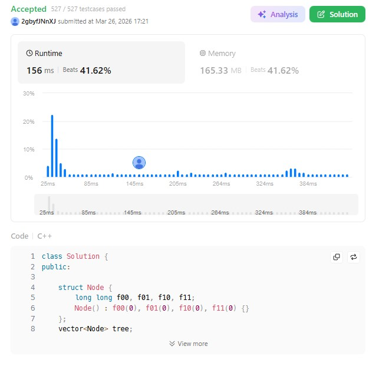

# 3165. Maximum Sum of Subsequence With Non-adjacent Elements (Hard)

### 題目說明
- 動態更新數組元素。
- 每次更新後求「不相鄰子序列」的最大和。
- 數據規模 $5 \times 10^4$，需達成 $O(\log N)$ 的單次更新效率。

### 解題策略：Dynamic DP + 線段樹
1. **狀態定義**：每個線段樹節點維護區間  $[L, R]$ 的四種狀態 $(f_{00}, f_{01}, f_{10}, f_{11})$，分別代表左右端點「必不選」或「可選」的情況。
2. **區間合併**：合併左右區間時，利用中間相鄰點不能同時選取的約束，進行狀態轉移。
3. **單點修改**：利用線段樹結構，每次修改只需更新 $\log N$ 個節點。

### 複雜度分析
- 時間複雜度： $O((N + Q) \log N)$
- 空間複雜度： $O(N)$

### 程式碼實作 (C++)
```cpp
class Solution {
public:

    struct Node {
        long long f00, f01, f10, f11;
        Node() : f00(0), f01(0), f10(0), f11(0) {}
    };
    vector<Node> tree;
    int n;

    Node merge(const Node& l, const Node& r) {
        Node res;
        res.f00 = max(l.f00 + r.f10, l.f01 + r.f00);
        res.f01 = max(l.f00 + r.f11, l.f01 + r.f01);
        res.f10 = max(l.f10 + r.f10, l.f11 + r.f00);
        res.f11 = max(l.f10 + r.f11, l.f11 + r.f01);
        return res;
    }

    void update(int u, int l, int r, int idx, int val) {
        if (l == r) {
            tree[u].f11 = max(0, val);
            return;
        }
        int mid = (l + r) >> 1;
        if (idx <= mid) update(u << 1, l, mid, idx, val);
        else update(u << 1 | 1, mid + 1, r, idx, val);
        tree[u] = merge(tree[u << 1], tree[u << 1 | 1]);
    }

    int maximumSumSubsequence(vector<int>& nums, vector<vector<int>>& queries) {
        n = nums.size();
        tree.resize(4 * n);
        
        for (int i = 0; i < n; ++i) {
            update(1, 0, n - 1, i, nums[i]);
        }

        long long total_ans = 0;
        const int MOD = 1e9 + 7;

        for (const auto& q : queries) {
            update(1, 0, n - 1, q[0], q[1]);
            total_ans = (total_ans + tree[1].f11) % MOD;
        }

        return (int)total_ans;
    }
};
```

