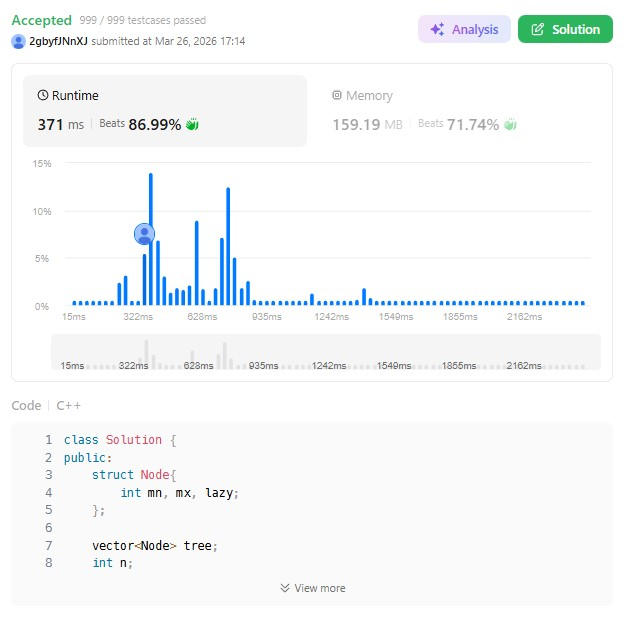

# 3721. Longest Balanced Subarray II (Hard)

### 題目說明
- 平衡定義：子陣列中「不同」偶數數量 = 「不同」奇數數量。
- 核心挑戰：處理「不同」導致前綴和會動態變化。

### 解題策略：線段樹 + 貢獻度撤銷
1. 將每個數字視為一個貢獻值（奇 +1, 偶 -1）。
2. 只計算每個數字在子陣列中「最後一次出現」位置的貢獻。
3. 利用線段樹維護動態變化的前綴和，並搜尋最早的平衡點。

### 複雜度分析
- 時間複雜度： $O(n \log n)$
- 空間複雜度： $O(n)$

### 程式碼實作 (C++)
```cpp
class Solution {
public:
    struct Node{
        int mn, mx, lazy;
    };

    vector<Node> tree;
    int n;

    void push_down(int u){
        if (tree[u].lazy != 0){
            int v = tree[u].lazy;
            tree[u << 1].mn += v;
            tree[u << 1].mx += v;
            tree[u << 1].lazy += v;

            tree[u << 1 | 1].mn += v; 
            tree[u << 1 | 1].mx += v; 
            tree[u << 1 | 1].lazy += v;

            tree[u].lazy = 0;
        }
    }
    void push_up(int u){
        tree[u].mn = min(tree[u << 1].mn, tree[u << 1 | 1].mn);
        tree[u].mx = max(tree[u << 1].mx, tree[u << 1 | 1].mx);
    }

    void update(int u, int l, int r, int qL, int qR, int v){
        if (qL <= l && r <= qR){
            tree[u].mn += v;
            tree[u].mx += v;
            tree[u].lazy += v;
            return;
        }
        push_down(u);
        int mid = (l + r) >> 1;
        if (qL <= mid) update(u << 1, l, mid, qL, qR, v);
        if (qR > mid) update(u << 1 | 1, mid + 1, r, qL, qR, v);
        push_up(u);
    }

    int query(int u, int l, int r, int target) {
        if (l == r) return l;
        push_down(u);
        int mid = (l + r) >> 1;

        if (tree[u << 1].mn <= target && target <= tree[u << 1].mx)
            return query(u << 1, l, mid, target);
        return query(u << 1 | 1, mid + 1, r, target);
    }

    int longestBalanced(vector<int>& nums) {
        n = nums.size();
        tree.assign(4 * (n + 1), {0, 0, 0});
        unordered_map<int, int> last;
        int ans = 0, current_balance = 0;

        for (int i = 1; i <= n; ++i) {
            int x = nums[i - 1];
            int det = (x % 2 != 0) ? 1 : -1;

            if (last.count(x)) {
                update(1, 0, n, last[x], n, -det);
                current_balance -= det;
            }

            last[x] = i;
            update(1, 0, n, i, n, det);
            current_balance += det;

            int pos = query(1, 0, n, current_balance);
            ans = max(ans, i - pos);
        }
        return ans;
    }
};
```

