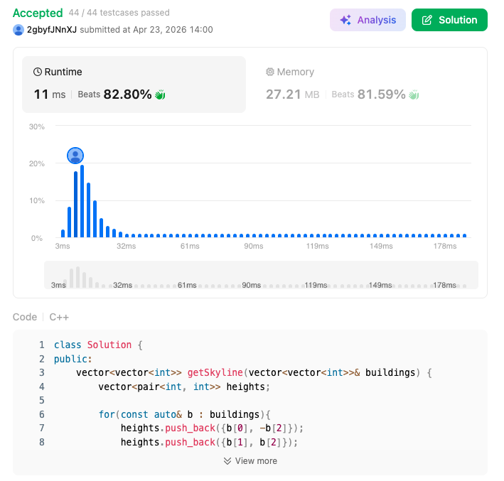

# 218. The Skyline Problem (Hard)

### 題目說明
給定 $n$ 座建築物的位置與高度，每座建築物以 $[L_i, R_i, H_i]$ 表示。請回傳這些建築物所形成的「天際線」關鍵點（所有水平線段的左端點）。

### 解題邏輯：掃描線與延遲刪除 (Lazy Deletion)
本演算法利用掃描線掃過所有邊界，並用最大堆（Max-priority queue）維護目前最高的高度。
1. **事件化**：將建築物拆為左邊界（高度取負值）與右邊界（高度取正值）。
2. **排序**：利用 `std::pair` 的排序特性處理事件點。
3. **堆疊管理**：
   - 遇到左邊界（ $h < 0$ ）：推入堆疊，若天際線變高則記錄。
   - 遇到右邊界（ $h > 0$ ）：
     - 若不是當前最高點：記錄在 `del` map 中（延遲刪除）。
     - 若是當前最高點：彈出並清理堆疊頂端所有已標記刪除的高度。

### 複雜度分析
- 時間複雜度： $O(N \log N)$ ，排序為瓶頸。
- 空間複雜度： $O(N)$ ，儲存事件點與 `del` 狀態。

### 程式碼實作 (C++)
```cpp
class Solution {
public:
    vector<vector<int>> getSkyline(vector<vector<int>>& buildings) {
        vector<pair<int, int>> heights;

        for(const auto& b : buildings){
            heights.push_back({b[0], -b[2]});
            heights.push_back({b[1], b[2]});
        }

        sort(heights.begin(), heights.end());

        priority_queue<int> cur_h;
        unordered_map<int, int> del;
        cur_h.push(0);

        vector<vector<int>> ans;

        for(auto& height : heights){
            int x = height.first;
            int h = height.second;
            int prev_h = cur_h.top();

            if (h < 0){
                cur_h.push(-h);
                if (cur_h.top() != prev_h){
                    ans.push_back({x, -h});
                }
            }
            else{
                if (prev_h != h){
                    del[h]++;
                }
                else{
                    cur_h.pop();
                    while(del.count(cur_h.top()) && del[cur_h.top()] > 0){
                        del[cur_h.top()]--;
                        cur_h.pop();
                    }
                    if (cur_h.top() != prev_h){
                        ans.push_back({x, cur_h.top()});    
                    }
                }
            }
        }

        return ans;
    }
};
```

