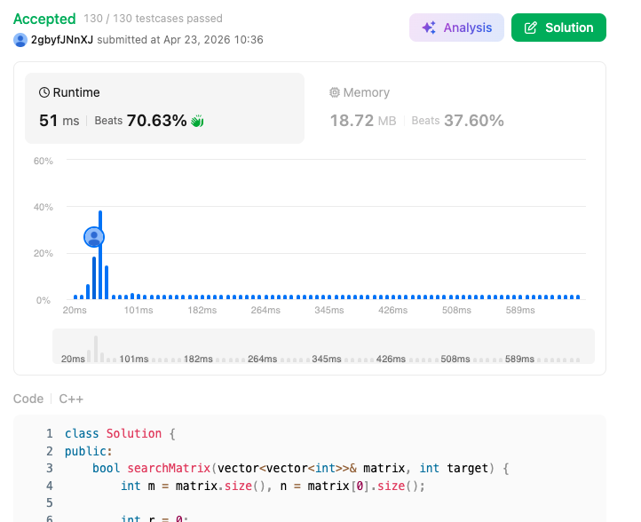

# 240. Search a 2D Matrix II (Medium)

### 題目說明
在一個每一行與每一列都已排序的 $m \times n$ 矩陣中，尋找目標值 `target`。

### 解題邏輯：右上角決策搜尋
利用矩陣的排序特性，將搜尋起點設為右上角 $(0, n-1)$。
1. **若 target < 當前值**：往左移動，排除當前列。
2. **若 target > 當前值**：往下移動，排除當前行。
3. **若相等**：回傳 true。

本演算法本質上是將矩陣視為一棵二元搜尋樹（BST），每次操作皆能排除一行或一列，從而達成線性時間複雜度。

### 複雜度分析
- **時間複雜度**：$O(m + n)$。
- **空間複雜度**：$O(1)$。

### 程式碼實作 (C++)
```cpp
class Solution {
public:
    bool searchMatrix(vector<vector<int>>& matrix, int target) {
        int m = matrix.size(), n = matrix[0].size();

        int r = 0;
        int c = n - 1;

        while(r < m && c >= 0){
            if (matrix[r][c] == target) return true;

            else if (matrix[r][c] < target) r++;
            else c--;
        }
        return false;

    }
};
```

### 執行結果截圖

