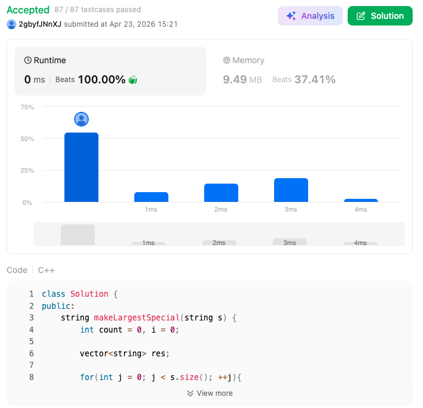

# 761. Special Binary String (Hard)

### 題目說明
給定一個特殊二進位字串 $S$（滿足 $1, 0$ 數量相等且任一前綴 $1 \ge 0$），透過交換相鄰的特殊子字串，求出字典序最大的結果。

### 解題邏輯：Dyck Path 遞迴排序
本題的核心在於將字串視為由數個「不可再分」的山脈（Irreducible components）組成。
1. **拆解 (Decomposition)**：利用計數器 `count` 找出所有回到海平面的點，將字串切分為獨立的山脈單元。
2. **遞迴與剝殼 (Peeling & Recursion)**：
   - 每一座山脈必為 `1` 開頭 `0` 結尾。
   - 剝除外殼後，內部的結構依然符合特殊字串定義。
   - 遞迴呼叫函數，確保「山脈內部的起伏」已達成字典序最大。
3. **貪婪組合 (Greedy Reconstruction)**：
   - 將所有處理完的山脈單元存入 `vector<string>`。
   - 執行降序排序（`greater<string>`），確保字典序大的單元靠前。

### 複雜度分析
- 時間複雜度： $O(N^2)$ 。每一層遞迴涉及字串切片與排序，總規模受限於 $N \le 50$。
- 空間複雜度： $O(N)$ ，遞迴深度與暫存字串所需空間。

### 程式碼實作 (C++)
```cpp
class Solution {
public:
    string makeLargestSpecial(string s) {
        int count = 0, i = 0;
        vector<string> res;

        for (int j = 0; j < s.size(); ++j) {
            if (s[j] == '1') count++;
            else count--;

            if (count == 0) {
                res.push_back("1" + makeLargestSpecial(s.substr(i + 1, j - i - 1)) + "0");
                i = j + 1;
            }
        }

        sort(res.begin(), res.end(), greater<string>());

        string ans = "";
        for (const string& r : res) ans += r;
        return ans;
    }
};
```

### 執行結果截圖

