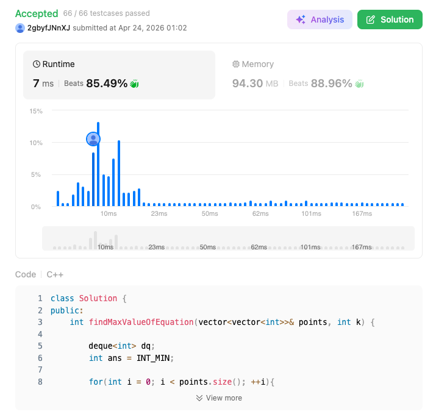

# 1499. Max Value of Equation (Hard)

### 題目說明
給定一組按 $x$ 座標排序的點 `points` 和整數 $k$。求 $y_i + y_j + |x_i - x_j|$ 的最大值，其中 $i < j$ 且 $|x_i - x_j| \le k$。

### 解題邏輯：代數轉換與單調隊列
1. **方程式轉換**：由於 $x_i < x_j$，原式可化為 $(y_i - x_i) + (y_j + x_j)$。
2. **問題歸約**：對於每個點 $j$，我們只需在滿足 $x_j - x_i \le k$ 的 $i$ 中，尋找 $(y_i - x_i)$ 的最大值。
3. **單調隊列優化 (Monotonic Queue)**：
   - 使用 `deque` 維護一個索引序列，使得對應的 $(y - x)$ 值由大到小排列。
   - **過期處理**：移除距離超過 $k$ 的點。
   - **更新答案**：使用隊首（當前最大 $(y-x)$）與當前點計算結果。
   - **維護單調**：將當前點 $(y_j - x_j)$ 插入隊尾，並彈出所有比它小的元素。

### 複雜度分析
- 時間複雜度： $O(N)$。每個元素最多進出隊列各一次。
- 空間複雜度： $O(N)$。

### 程式碼實作 (C++)
```cpp
class Solution {
public:
    int findMaxValueOfEquation(vector<vector<int>>& points, int k) {

        deque<int> dq;
        int ans = INT_MIN;

        for(int i = 0; i < points.size(); ++i){
            while(!dq.empty() && points[i][0] - points[dq.front()][0] > k){
                dq.pop_front();
            }

            if (!dq.empty()){
                ans = max(ans, points[dq.front()][1] - points[dq.front()][0] + points[i][0] + points[i][1]);
            }

            while(!dq.empty() && points[i][1] - points[i][0] >= points[dq.back()][1] - points[dq.back()][0]){
                dq.pop_back();
            }

            dq.push_back(i);
        }
        return ans;
    }
};
```

