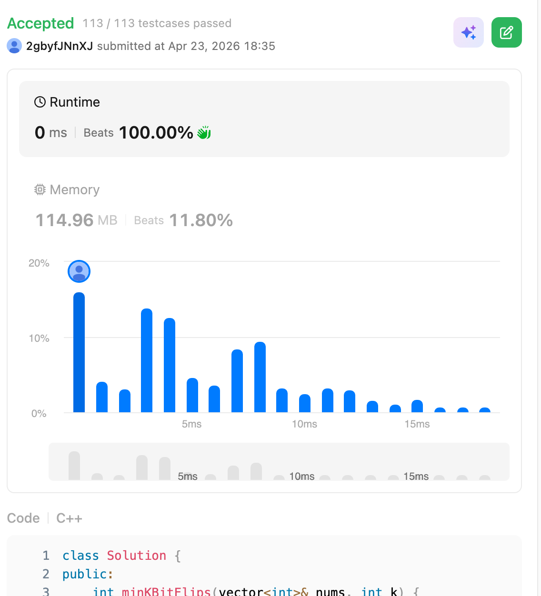

# 995. Minimum Number of K Consecutive Bit Flips (Hard)

### 題目說明
給定一個二進位陣列 `nums` 與一個整數 $k$。每次操作可以選擇一個長度為 $k$ 的連續子區間，並將其中所有的 $0$ 變 $1$，$1$ 變 $0$。求使陣列全部變為 $1$ 的最少操作次數。若無法達成，回傳 $-1$。

### 解題邏輯：貪婪決策與滑動窗口
1. **貪婪策略 (Greedy Strategy)**：
   當我們從左向右掃描時，若遇到一個元素為 $0$，為了讓它變成 $1$，我們**別無選擇**，必須以此位置為起點，進行一次長度為 $k$ 的翻轉。因為左邊的元素已經處理好了，我們不希望再動到它們。

2. **優化：翻轉狀態維護**：
   若真的對陣列進行 $k$ 個元素的修改，複雜度會達到 $O(nk)$，導致 TLE。
   - 我們定義一個變數 `diff`，代表**目前位置受到的有效翻轉次數**。
   - 若 `diff` 為偶數，且 `nums[i] == 0` $\implies$ 需要翻轉。
   - 若 `diff` 為奇數，且 `nums[i] == 1` $\implies$ 需要翻轉（因為原本的 1 變成了 0）。
   - 歸納為：若 `(nums[i] + diff) % 2 == 0`，則必須翻轉。

3. **差分思想 (Difference Array)**：
   當我們在位置 $i$ 進行翻轉，這個影響會持續到 $i + k - 1$。我們可以用一個額外的陣列 `is_flipped` 紀錄在哪個位置「結束」了翻轉，以便在掃描到該處時更新 `diff`。

### 複雜度分析
- 時間複雜度： $O(n)$，只需遍歷一次陣列。
- 空間複雜度： $O(n)$，用於儲存翻轉狀態（亦可優化至 $O(1)$，若允許修改原陣列）。

### 程式碼實作 (C++)
```cpp
class Solution {
public:
    int minKBitFlips(vector<int>& nums, int k) {
        int n = nums.size();
        vector<int> is_flipped(n, 0); 
        int diff = 0; 
        int ans = 0;

        for (int i = 0; i < n; ++i) {
            if (i >= k && is_flipped[i - k]) {
                diff--;
            }

            if ((nums[i] + diff) % 2 == 0) {
                if (i + k > n) return -1;

                is_flipped[i] = 1; 
                diff++;          
                ans++;
            }
        }

        return ans;
    }
};
};
```

### 執行結果截圖

