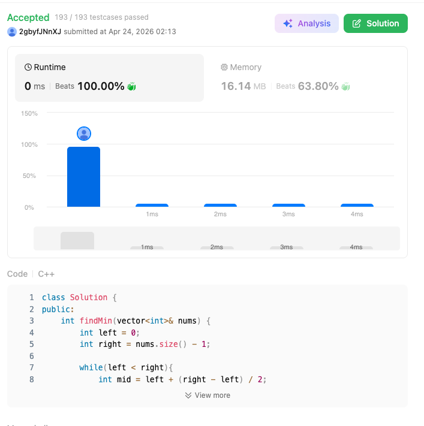

# 154. Find Minimum in Rotated Sorted Array II (Hard)

### 題目說明
一個原本按升序排序的陣列在某個未知的軸點上進行了旋轉。陣列中**可能包含重複元素**。請找出其中的最小元素。

### 解題邏輯：二進位搜尋與邊界縮減
本題的核心在於利用二分搜尋法縮小範圍，但必須處理重複元素導致的決策模糊：

1. **二分比較**：設定 `left` 與 `right` 指標，並取 `mid`。
2. **三種狀況判斷**：
   - 若 `nums[mid] < nums[right]`：說明從 `mid` 到 `right` 是連續遞增的，最小值必然在 `left` 到 `mid` 之間（含 `mid`）。
   - 若 `nums[mid] > nums[right]`：說明旋轉軸點（及最小值）在 `mid` 右側。
   - **若 `nums[mid] == nums[right]`**：這是本題與 153 題的關鍵差異。由於存在重複，我們無法判斷最小值在左側還是右側（例如 `[1, 0, 1, 1, 1]` 與 `[1, 1, 1, 0, 1]`）。
3. **退化策略**：當相等發生時，我們唯一能確定的是：即使 `nums[right]` 是最小值，`nums[mid]` 也是一樣的值且仍在範圍內。因此，我們可以安全地執行 `right--`，將問題規模縮小 1。

### 複雜度分析
- 時間複雜度：平均 $O(\log N)$，最差情況下為 $O(N)$（當陣列元素全部相同時）。
- 空間複雜度： $O(1)$。

### 程式碼實作 (C++)
```cpp
class Solution {
public:
    int findMin(vector<int>& nums) {
        int left = 0;
        int right = nums.size() - 1;

        while(left < right){
            int mid = left + (right - left) / 2;

            if (nums[mid] < nums[right]){
                right = mid;
            }
            else if (nums[mid] > nums[right]){
                left = mid + 1;
            }
            else{
                right--;
            }
        }
        return nums[left];
    }
};
```

