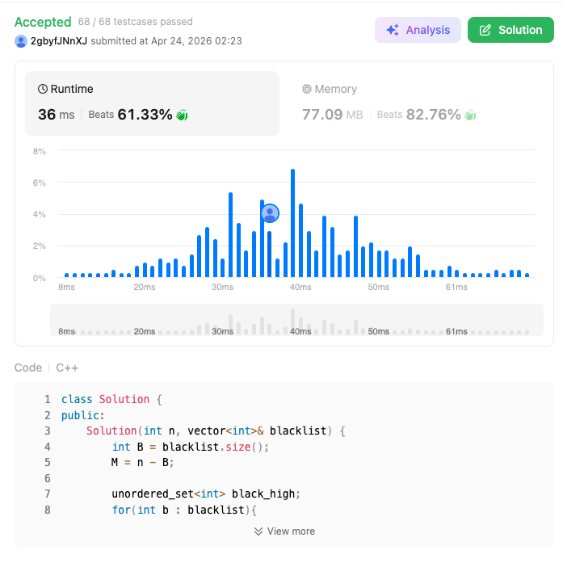

# 710. Random Pick with Blacklist (Hard)

### 題目說明
給定一個整數 $n$ 和一個黑名單 `blacklist`。設計一個演算法，從 $[0, n-1]$ 範圍內隨機選取一個**不在**黑名單中的整數。藍圖是確保選取機率是均勻的，且儘量減少對隨機函數的調用。

### 解題邏輯：虛擬映射 (Mapping to Valid Range)
1. **空間壓縮**：假設黑名單長度為 $B$，則合法數字的總數為 $M = n - B$。我們希望隨機取樣的範圍限制在 $[0, M-1]$ 之間。
2. **重映射 (Re-mapping)**：
   - 如果隨機抽到的數字 $x \in [0, M-1]$ 剛好在黑名單中，我們需要將它「映射」到一個位於 $[M, n-1]$ 範圍內的**合法數字**。
   - 這樣做的好處是，我們只需要在 $[0, M-1]$ 產生隨機數，就能覆蓋到所有合法的元素，且機率分佈依然保持均勻（Uniform Distribution）。
3. **建立映射表**：
   - 首先將黑名單中 $\ge M$ 的數字放入一個集合。
   - 遍歷黑名單中 $< M$ 的數字，將它們與 $[M, n-1]$ 中「非黑名單」的數字一一對應，存入 Hash Map。

### 複雜度分析
- 時間複雜度：
  - 預處理（建構函數）： $O(B \log B)$ 或 $O(B)$，取決於排序或 Hash Map 的操作。
  - 抽樣（`pick`）： $O(1)$。
- 空間複雜度： $O(B)$，用於儲存映射關係。

### 程式碼實作 (C++)
```cpp
class Solution {
public:
    Solution(int n, vector<int>& blacklist) {
        int B = blacklist.size();
        M = n - B;

        unordered_set<int> black_high;
        for(int b : blacklist){
            if (b >= M) black_high.insert(b);
        }

        int last = M;
        for (int b : blacklist){
            if (b < M) {
                while (black_high.count(last)){
                    last++;
                }
                mapping[b] = last;
                last++;
            }
        }
    }
    
    int pick() {
        int idx = rand() % M;

        if (mapping.count(idx)){
            return mapping[idx];
        }
        return idx;
    }
private:
    int M;
    unordered_map<int, int> mapping;
};

/**
 * Your Solution object will be instantiated and called as such:
 * Solution* obj = new Solution(n, blacklist);
 * int param_1 = obj->pick();
 */
```

