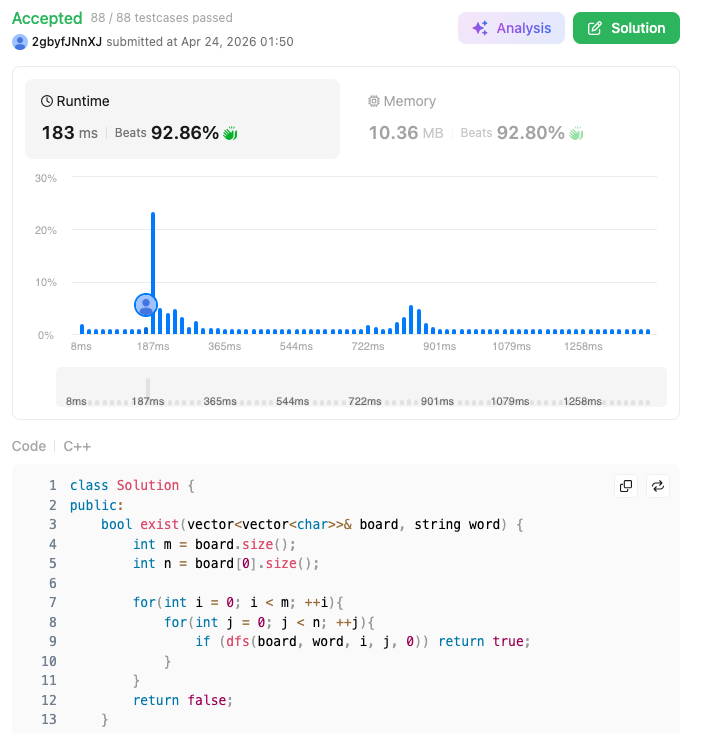

這題 **79. Word Search** 是典型的\*\*回溯法（Backtracking）\*\*問題。在應用數學中，這可以看作是在一個圖（Graph）中尋找特定路徑的過程。

### 79\. Word Search (Medium)

### 題目說明

給定一個 $m \times n$ 的字元矩陣 `board` 和一個字串 `word`。判斷 `word` 是否存在於矩陣中。單字必須由相鄰（水平或垂直）的單元格組成，且同一個單元格在一次路徑中不可重複使用。

### 解題邏輯：深度優先搜尋 (DFS) 與回溯

1.  **起點遍歷**：遍歷矩陣中的每一個格子，若格子的字元與 `word[0]` 相同，則以此為起點進行 DFS。
2.  **探路規則 (DFS)**：
      - **終止條件**：若當前比對的索引等於 `word` 的長度，代表全數比對成功，回傳 `true`。
      - **邊界與剪枝**：若座標超出矩陣範圍、字元不匹配、或該格子已被訪問過，回傳 `false`。
3.  **狀態標記與還原 (Backtracking)**：
      - 為了確保「同一個單元格不重複使用」，進入 DFS 時，將當前格子字元暫時修改為特殊字元（如 `#`）。
      - 遞迴探索上下左右四個方向。
      - **關鍵**：遞迴結束後（不論成功或失敗），必須將該格子的字元**還原**，以免影響其他路徑的搜尋。

### 複雜度分析

  - 時間複雜度： $O(M \cdot N \cdot 3^L)$。其中 $M, N$ 是矩陣維度，$L$ 是單字長度。每次搜尋有 4 個方向，但扣除來的方向後剩 3 個選擇。
  - 空間複雜度： $O(L)$。遞迴堆疊的最大深度為單字長度。

### 程式碼實作 (C++)

```cpp
class Solution {
public:
    bool exist(vector<vector<char>>& board, string word) {
        int m = board.size();
        int n = board[0].size();

        for(int i = 0; i < m; ++i){
            for(int j = 0; j < n; ++j){
                if (dfs(board, word, i, j, 0)) return true;
            }
        }
        return false;
    }

private:
    bool dfs(vector<vector<char>>& board, string& word, int r, int c, int index){
        if (index == word.size()) return true;

        if (r < 0 || r >= board.size() || c < 0 || c >= board[0].size() || board[r][c] != word[index]){
            return false;
        }
        char tmp = board[r][c];
        board[r][c] = '#';

        bool found = dfs(board, word, r + 1, c, index + 1) ||
                     dfs(board, word, r, c + 1, index + 1) ||
                     dfs(board, word, r - 1, c, index + 1) ||
                     dfs(board, word, r, c - 1, index + 1);
        board[r][c] = tmp;

        return found;
    }
};
```

