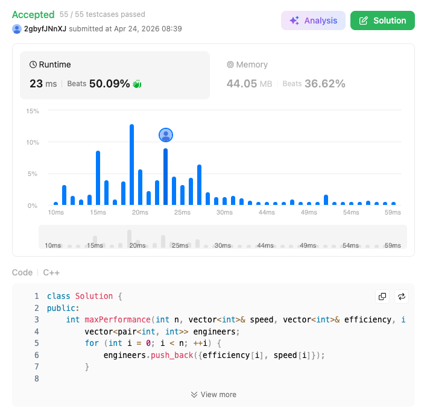

# 1383. Maximum Performance of a Team (Hard)

### 題目說明
給定 $n$ 個工程師的速度 `speed` 與效率 `efficiency`。從中挑選最多 $k$ 個人組成團隊，極大化其表現（總速度和 $\times$ 團隊中最低效率值）。由於結果可能很大，需對 $10^9 + 7$ 取模。

### 解題邏輯：貪婪法與優先隊列
1. **排序 (Greedy Choice)**：將工程師按效率由大到小排序。這樣在遍歷到第 $i$ 個工程師時，若他加入團隊，他必然是該團隊中效率最低的人。
2. **維護最大速度和**：使用一個最小堆積 (Min-Heap) 來紀錄目前看過的工程師中速度最快的前 $k$ 位。
3. **動態更新**：
   - 逐一將工程師加入。
   - 若人數超過 $k$，從堆積中剔除速度最慢的人（以保持總速度和最大）。
   - 每次加入新工程師（作為效率瓶頸）後，計算當前表現並更新全域最大值。

### 複雜度分析
- 時間複雜度：$O(N \log N)$。排序需要 $N \log N$，遍歷 $N$ 個元素並維護堆積需要 $N \log k$。
- 空間複雜度：$O(N + k)$。存儲配對陣列與堆積。

### 程式碼實作 (C++)
```cpp
class Solution {
public:
    int maxPerformance(int n, vector<int>& speed, vector<int>& efficiency, int k) {
        // [說明] 將速度與效率配對，以便進行排序
        vector<pair<int, int>> engineers;
        for (int i = 0; i < n; ++i) {
            engineers.push_back({efficiency[i], speed[i]});
        }

        // [核心] 按效率降序排序 (Efficiency Descending)
        sort(engineers.rbegin(), engineers.rend());

        // [說明] min_heap 存儲團隊中前 k 大的速度，當人數超過 k 時彈出最小的速度
        priority_queue<int, vector<int>, greater<int>> min_heap;
        long long sum_speed = 0;
        long long max_perf = 0;

        for (auto& [e, s] : engineers) {
            sum_speed += s;
            min_heap.push(s);

            // 如果團隊人數超過 k，踢掉速度最慢的人 (Greedy)
            if (min_heap.size() > k) {
                sum_speed -= min_heap.top();
                min_heap.pop();
            }

            // 更新最大表現：(當前總速度 * 當前最低效率)
            max_perf = max(max_perf, sum_speed * e);
        }

        return max_perf % 1000000007;
    }
};
```

