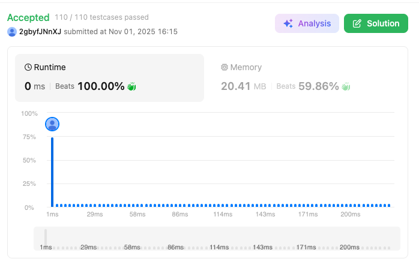

# 45. Jump Game II (Hard)

### 題目說明
給定一個非負整數陣列 `nums`，你最初位於第一個索引。每個元素代表你在該位置可以跳躍的最大長度。目標是使用最少的跳躍次數到達最後一個索引。假設你總是能到達末尾。

### 解題邏輯：貪婪區間擴張 (Greedy Range Expansion)
本題的核心在於「每一跳都極大化未來的覆蓋範圍」。
1. **區間思維**：將跳躍視為 BFS 的層級。第一跳覆蓋一個區間，第二跳則覆蓋從第一跳區間內所有點能到達的最遠區間。
2. **雙指標維護**：
   - `maxIdx`：紀錄當前區間內所有點能跳到的「最遠位置」。
   - `curMax`：紀錄當前跳躍步數所能覆蓋的「權利邊界」。
3. **跳躍時機**：當遍歷指標 `i` 到達 `curMax` 時，代表必須進行下一跳，更新邊界為 `maxIdx`，跳躍次數 `minJ++`。

### 複雜度分析
- 時間複雜度： $O(N)$。只需對陣列進行一次線性掃描。
- 空間複雜度： $O(1)$。僅使用常數個變數。

### 程式碼實作 (C++)
```cpp
class Solution {
public:
    int jump(vector<int>& nums) {
        int n = nums.size();

        if (n == 1) return 0;
        int minJ = 0;

        int curMax = 0;
        int maxIdx = 0;
        for (int i = 0; i < n; ++i)        {

            maxIdx = max(maxIdx, i + nums[i]);
            if (i == curMax){
                curMax = maxIdx;
                minJ++;
            }
            if (curMax >= n - 1) return minJ;
        }
        return minJ;
    }
};
```

