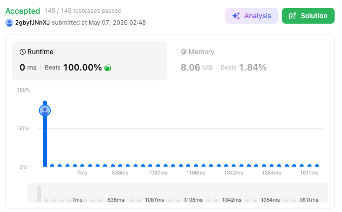

# 2139. Minimum Moves to Reach Target Score (Medium)

### 題目說明
你從整數 1 開始，目標是達到 `target`。你可以在每一步執行：
1. 將當前數字加 1。
2. 將當前數字翻倍（此操作最多只能執行 `maxDoubles` 次）。
求達到 `target` 的最少行動次數。

### 解題邏輯：逆向貪婪演算法 (Reverse Greedy)
本題採用「逆向思考」最為高效。我們從 `target` 往回推到 1：
1. **除法優先**：為了最快縮小數字，只要目前是偶數且還有翻倍機會，就優先執行「除以 2」。
2. **處理奇數**：若目前為奇數，必須先「減 1」轉為偶數，才能進行後續的除法。
3. **剩餘步數優化**：當翻倍次數 `maxDoubles` 耗盡後，剩下的所有操作都只能是「減 1」。此時我們可以直接用 `cur - 1` 算出剩餘步數，避開逐一減法的迴圈。

### 複雜度分析
- 時間複雜度： $O(\min(\text{maxDoubles}, \log \text{target}))$。每次除法都會使數字減半，操作次數受限於翻倍次數或對數級的目標值。
- 空間複雜度： $O(1)$。僅使用常數個變數。

### 程式碼實作 (C++)
```cpp
class Solution {
public:
    int minMoves(int target, int maxDoubles) {
        int moves = 0;
        int cur = target;

        while(cur > 1 && maxDoubles > 0){
            if (cur % 2 == 0){
                cur /= 2;
                maxDoubles--;
                moves++;
            }
            else{
                cur -= 1;
                moves++;
            }
        }
        if (cur > 1){
            moves += cur - 1;
        }
        return moves;
    }
};
```

