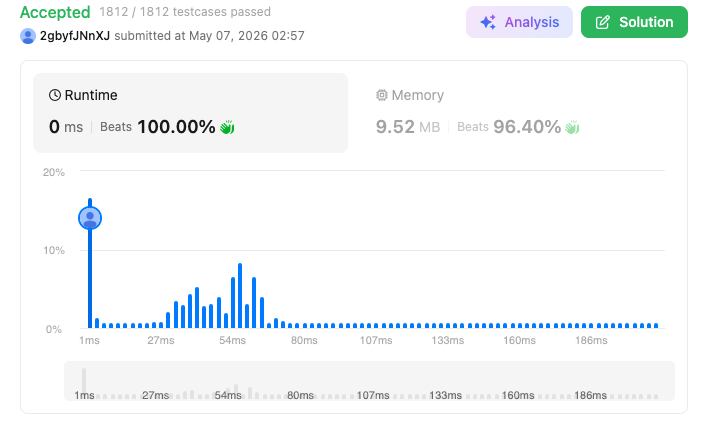

# 44. Wildcard Matching (Hard)

### 題目說明
給定一個字串 `s` 和一個模式 `p`，實作支持 `'?'` 和 `'*'` 的通配符匹配。
- `'?'` 匹配單一字元。
- `'*'` 匹配任意字元序列（含空序列）。

### 解題邏輯：貪婪回溯與雙指標優化 (Greedy Backtracking)
本演算法捨棄了傳統動態規劃 $O(MN)$ 的空間開銷，採用雙指標配合「關鍵回溯」策略。

1. **存檔點機制 (Checkpointing)**：當遇到 `'*'` 時，我們不立即展開所有可能性，而是先「貪婪」地假設它匹配空字串，並紀錄當前模式與字串的索引（`star_idx`, `match_idx`）。這在狀態搜尋中相當於建立一個存檔點。
2. **線性搜尋與回溯**：
   - **字元匹配**：若當前字元匹配，雙指標同步前移。
   - **遇到星號**：更新存檔點，模式指標前移。
   - **匹配失敗但存在星號**：此時觸發「回溯」，我們讀取存檔點，讓星號多匹配字串中的一個字元（`match_idx++`），然後從星號後方重新搜尋。
3. **剪枝原理 (Pruning)**：本算法最核心的數學直覺在於——我們只需要紀錄「最後一個」遇到的星號。因為後面的星號具備更大的自由度，足以覆蓋前面星號的所有匹配情況，從而大幅縮減了回溯的搜尋空間。

### 複雜度分析
- 時間複雜度：平均 $O(M + N)$，但在最差情況下（如 $s = \text{"aaaaab"}$, $p = \text{"*aaaaa"}$）會退化至 $O(M \times N)$。
- 空間複雜度： $O(1)$。僅使用常數個整數變數。

### 程式碼實作 (C++)
```cpp
class Solution {
public:
    bool isMatch(string s, string p) {
        int si = 0, pi = 0;
        int match_idx = 0, star_idx = -1;
        int sn = s.length(), pn = p.length();

        while (si < sn) {
            if (pi < pn && (p[pi] == '?' || p[pi] == s[si])) {
                si++; pi++;
            } 
            else if (pi < pn && p[pi] == '*') {
                star_idx = pi;
                match_idx = si;
                pi++;
            } 
            else if (star_idx != -1) {
                pi = star_idx + 1;
                match_idx++;
                si = match_idx;
            } 
            else {
                return false;
            }
        }
        
        while (pi < pn && p[pi] == '*') {
            pi++;
        }

        return pi == pn;
    }
};
```

