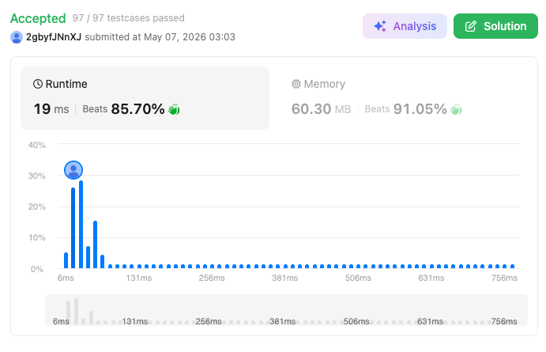

# 630. Course Schedule III (Hard)

### 題目說明
給定 $n$ 門課，每門課由 `[duration, lastDay]` 表示。你必須在 `lastDay` 或之前完成該課程。你不能同時修兩門課。求最多能修多少門課？

### 解題邏輯：貪婪法與最大堆積替換
本題的核心在於「透過捨棄長任務來優化總時間」。
1. **截止日期排序**：首先將課程按截止日期 `lastDay` 從早到晚排序。這是為了確保我們在處理每一門課時，都已經考慮了所有比它更早到期的限制。
2. **優先隊列維護**：使用一個最大堆積 (Max-Heap) 來紀錄目前已修課程的持續時間。
3. **動態決策**：
   - **情況 A（可修）**：若當前總時間加上新課程時間 $\le$ 該課截止日期，直接修讀。
   - **情況 B（不可修但可優化）**：若修了會超時，檢查堆積頂端（已修課中最耗時的）。若前人的時間大於當前課程，則「退掉」前人，改修當前課程。
   - **結果**：這樣做雖然修課總數沒變，但「總耗時」減少了，增加了未來修更多課的潛力。

### 複雜度分析
- 時間複雜度： $O(N \log N)$。排序需要 $O(N \log N)$，遍歷 $N$ 個元素且每次堆積操作為 $O(\log N)$。
- 空間複雜度： $O(N)$。最大堆積在最差情況下存儲所有課程。

### 程式碼實作 (C++)
```cpp
class Solution {
public:
    int scheduleCourse(vector<vector<int>>& courses) {
        sort(courses.begin(), courses.end(), [](const vector<int>& a, const vector<int>& b) {
            return a[1] < b[1];
        });

        priority_queue<int> max_heap;
        int total_time = 0;

        for (auto& course : courses) {
            int d = course[0];
            int l = course[1];

            if (total_time + d <= l) {
                total_time += d;
                max_heap.push(d);
            } 
            else if (!max_heap.empty() && max_heap.top() > d) {
                total_time -= max_heap.top();
                max_heap.pop();
                
                total_time += d;
                max_heap.push(d);
            }
        }

        return max_heap.size();
    }
};
```

