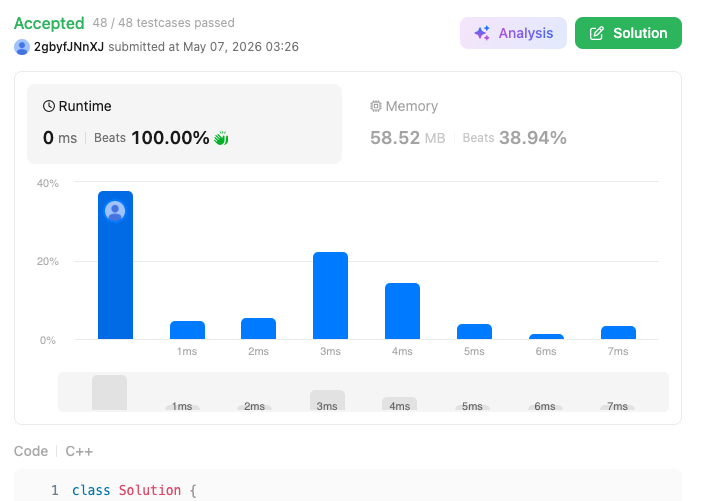

# 2366. Minimum Replacements to Sort the Array (Hard)

### 題目說明
給定一個整數陣列 `nums`。在一次操作中，你可以將任何一個元素替換為任意兩個和等於該元素的正整數。求使陣列變為非遞減序列（nums[i] <= nums[i+1]）所需的最少操作次數。

### 解題邏輯：逆向貪婪策略 (Reverse Greedy)
本題的核心在於從後往前維護一個「上限值」。
1. **逆向觀察**：最後一個元素 `nums[n-1]` 是最穩定的，我們將其視為左側元素的上限。
2. **均分拆解**：當遇到 `nums[i] > last` 時，必須進行拆分。
   - **極小化份數**：為了減少操作次數，拆分份數 $k$ 應為 $\lceil nums[i] / last \rceil$。在程式中可用 `(nums[i] + last - 1) / last` 計算。
   - **極大化下一個上限**：拆分後，為了給左側元素留出最大空間，拆出的最小值（最左側）應盡可能的大。根據均分原理，新上限為 `nums[i] / k`。
3. **貪婪證明**：由於我們從右向左工作，每一步都將「目前能提供的最大最小值」傳給左側，這保證了全域操作次數的最優性。

### 複雜度分析
- 時間複雜度： $O(N)$。只需一次線性掃描。
- 空間複雜度： $O(1)$。僅使用常數個變數。

### 程式碼實作 (C++)
```cpp
class Solution {
public:
    long long minimumReplacement(vector<int>& nums) {
        int n = nums.size();
        long long ans = 0;

        int last = nums[n - 1];

        for (int i = n - 2; i >= 0; --i) {
            if (nums[i] > last) {
                long long k = (1LL * nums[i] + last - 1) / last;
                
                ans += (k - 1);                            
                last = nums[i] / k;
            } else {                
                last = nums[i];
            }
        }

        return ans;
    }
};
```

