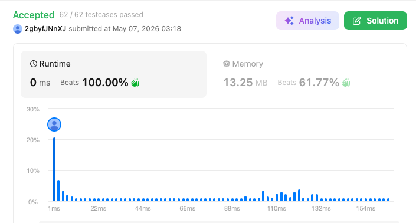

# 2405. Optimal Partition of String (Medium)

### 題目說明
給定一個字串 `s`，將其分割成一個或多個子字串，使得每個子字串中的字元都是唯一的（即同一個字母在單一子字串中最多出現一次）。求最少的分割子字串數量。

### 解題邏輯：貪婪法 (Greedy Approach)
本題的核心策略是「盡可能延長當前子字串的長度」。
1. **貪婪策略**：從左至右遍歷字串，將字元逐一加入當前子字串。只要當前字元尚未在該子字串出現過，我們就繼續累積。
2. **觸發切割**：一旦遇到一個已存在於當前子字串的字元，代表必須在此處進行分割。此時分割計數加 1，並開啟一個全新的子字串，重新開始紀錄。
3. **正確性直覺**：這種「走到底才切」的策略能保證每個區間都達到了極大化，從而使區間總數達到極小化。

### 複雜度分析
- 時間複雜度： $O(N)$。只需對字串進行一次線性掃描。
- 空間複雜度： $O(1)$。雖然需要紀錄字元出現狀態，但字元集固定為 26 個小寫字母，空間消耗為常數。

### 程式碼實作 (C++)
```cpp
class Solution {
public:
    int partitionString(string s) {
        vector<bool> seen(26, false);
        int count = 1;

        for (char c : s) {
            int idx = c - 'a';
            
            if (seen[idx]) {
                count++;
                fill(seen.begin(), seen.end(), false);
            }
            
            seen[idx] = true;
        }

        return count;
    }
};
```

