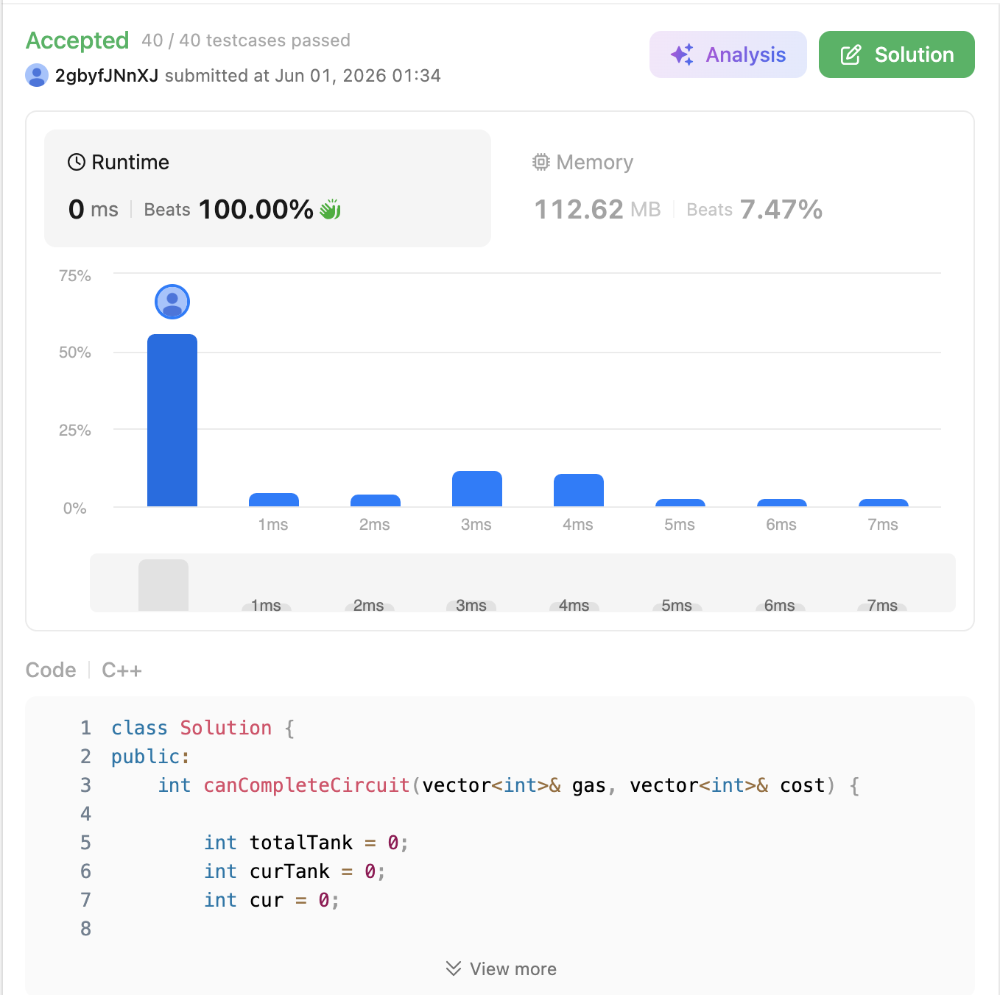

# 134. Gas Station (Medium)

### 題目說明

有 $N$ 個加油站成環形排列，給定兩個整數陣列 `gas` 和 `cost`。`gas[i]` 代表第 $i$ 個加油站的總油量，`cost[i]` 代表從第 $i$ 個加油站開到下一個第 $i+1$ 個加油站所需的油量。
一輛車油箱容量無限，請找出一個可以繞環形路線順時針行駛一圈的「出發站點索引」，若無法繞行一圈則回傳 `-1`。（題目保證若有解，則解為唯一）

### 解題邏輯：貪婪策略與局部排除 (Greedy & Local Exclusion)

這題的精髓在於透過一次遍歷（One Pass）同時解決「是否存在解」以及「解在哪裡」兩個問題。

1. **整體可行性判定 (Total Validity)**：使用 `totalTank` 記錄整趟旅程的總淨油量（`gas[i] - cost[i]` 的總和）。如果遍歷結束後 `totalTank < 0`，根據物質守恆定律，總油量都不夠總消耗了，無論從哪裡出發都絕對不可能繞完一圈，回傳 `-1`。
2. **起點動態推進 (Starting Point Shift)**：使用 `curTank` 記錄「從當前預設起點 `cur` 出發到現在」的累積油量。如果在到達第 $i$ 站時發現 `curTank < 0`，這意味著：
* 從 `cur` 到 $i$ 之間**任何一個站點**作為起點，開到 $i$ 站時都會沒油（因為這段路程前面累積的剩餘油量都是非負的，去掉前面只會更慘）。
* 因此，下一個唯一有希望的起點只能是 $i + 1$。我們將起點更新為 `cur = i + 1`，並將 `curTank` 歸零重新計算。


3. **最優性證明**：若 `totalTank >= 0` 且我們藉由上述規則找到了一個起點 `cur` 能成功走到終點，由於總淨油量非負，該起點必定能撐過前半段被我們跳過的路程，故 `cur` 即為唯一正解。

### 複雜度分析

* **時間複雜度**： $O(N)$。只需對 `gas` 和 `cost` 陣列進行一次線性遍歷，無需模擬繞環的過程。
* **空間複雜度**： $O(1)$。僅使用了 `totalTank`、`curTank` 與 `cur` 三個整數變數，不需額外配置記憶體。

### 程式碼實作 (C++)

```cpp
class Solution {
public:
    int canCompleteCircuit(vector<int>& gas, vector<int>& cost) {
        int totalTank = 0; // 記錄整體的總油量盈虧
        int curTank = 0;   // 記錄從當前起點出發的局部油量盈虧
        int cur = 0;       // 記錄可能的出發起點

        for (int i = 0; i < gas.size(); ++i) {
            int netGas = gas[i] - cost[i];
            totalTank += netGas;
            curTank += netGas;
            
            // 如果從 cur 出發到 i 站沒油了，代表 cur 到 i 都不能當起點
            if (curTank < 0) {
                curTank = 0;   // 重新計算區間油量
                cur = i + 1;   // 將起點推遲到下一站
            }
        }
        
        // 如果總盈虧小於 0，代表怎麼走都不可能繞一圈
        if (totalTank < 0) return -1;
        
        return cur;
    }
};
```
 
