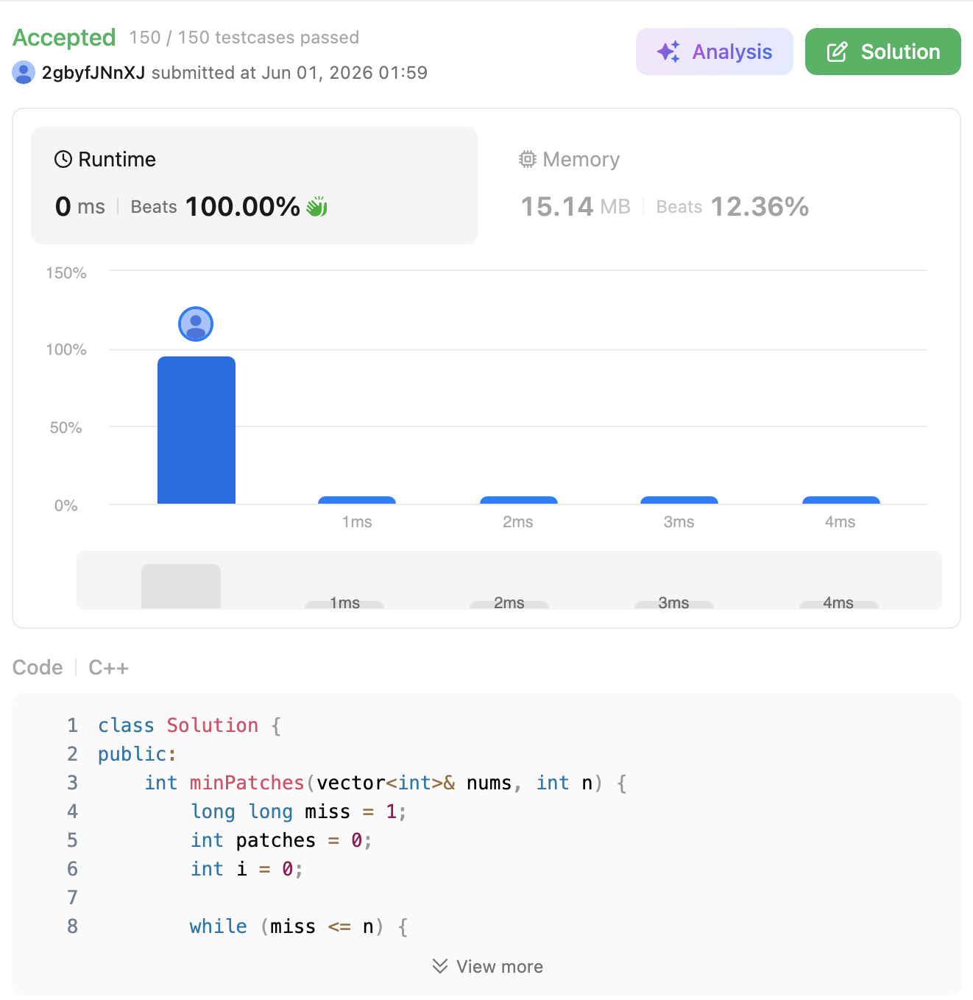

# 330. Patching Array (Hard)

### 題目說明

給定一個已排序的正整數陣列 `nums` 與一個正整數 `n`。要求你找出「最少」需要再添加（Patch）幾個數字到陣列中，才能使得區間 `[1, n]` 內的**任何一個整數**，都可以由陣列中若干個元素的總和組合而成。

### 解題邏輯：貪婪區間覆蓋 (Greedy Range Coverage)

這題的核心思維是維護一個變數 `miss`，它代表「目前我們無法組合出來的最小數字」。
如果我們能確保 `[1, miss - 1]` 內的數字都能被組合出來，那麼接下來的策略如下：

1. **初始狀態**：設定 `miss = 1`，代表我們一開始連 1 都組不出來，需要從 1 開始向上建構覆蓋區間 `[1, miss - 1]`（一開始為 `[1, 0]`，代表空）。
2. **利用現有數字擴展區間**：從左到右遍歷 `nums` 陣列。如果當前數字 `nums[i] <= miss`，代表這個數字可以無縫接軌我們目前的區間。加入這個數字後，我們能組合出的最大範圍會從 `miss - 1` 延伸到 `miss - 1 + nums[i]`，因此我們更新下一道無法跨越的門檻為：`miss += nums[i]`。
3. **貪婪修補 (Patching)**：如果 `nums[i] > miss`（或是我們已經用光了 `nums` 裡的數字），這代表出現了斷層，我們現在絕對組不出 `miss` 這個數字！
* 為了用最少的代價獲取最大的涵蓋範圍，我們**直接把 `miss` 這個數字加入陣列（貪婪選擇）**。
* 加入 `miss` 後，原本能組出的範圍 `[1, miss - 1]` 會全部向右平移 `miss`，也就是我們額外獲得了 `[miss, 2 * miss - 1]` 的覆蓋能力。兩者結合後，新的覆蓋區間變為 `[1, 2 * miss - 1]`。
* 因此，我們增加一次修補次數 (`patches++`)，並讓 `miss += miss`。


4. **終止條件**：持續重複上述步驟，直到 `miss > n`，代表區間 `[1, n]` 已被完全覆蓋。
* *注意：`miss` 在翻倍的過程中可能會超過 32-bit 帶號整數的上限，因此在 C++ 中必須宣告為 `long long`。*


### 複雜度分析

* **時間複雜度**： $O(M + \log N)$。其中 $M$ 是陣列 `nums` 的長度。遍歷陣列需要 $O(M)$ 步；而在貪婪修補時，`miss` 每次都會翻倍增長，最多只需要翻倍 $\log N$ 次就能超越 $N$。
* **空間複雜度**： $O(1)$。僅使用了常數個變數記錄 `miss`、陣列索引 `i` 與修補次數 `patches`。

### 程式碼實作 (C++)

```cpp
class Solution {
public:
    int minPatches(vector<int>& nums, int n) {
        long long miss = 1; // 目前無法被組合出的最小數字 (使用 long long 防止溢位)
        int patches = 0;    // 記錄添加了幾個數字
        int i = 0;          // 遍歷 nums 陣列的指標
        
        while (miss <= n) {
            // 如果 nums 還有數字，且該數字小於等於我們需要的 miss
            if (i < nums.size() && nums[i] <= miss) {
                miss += nums[i]; // 擴展可覆蓋區間
                i++;
            } else {
                // 如果 nums 裡的數字太大用不上，或是 nums 已經用完了
                // 我們必須強行加入數字 miss
                miss += miss;    // 可覆蓋區間翻倍
                patches++;       // 增加修補計數
            }
        }
        
        return patches;
    }
};
```
 
