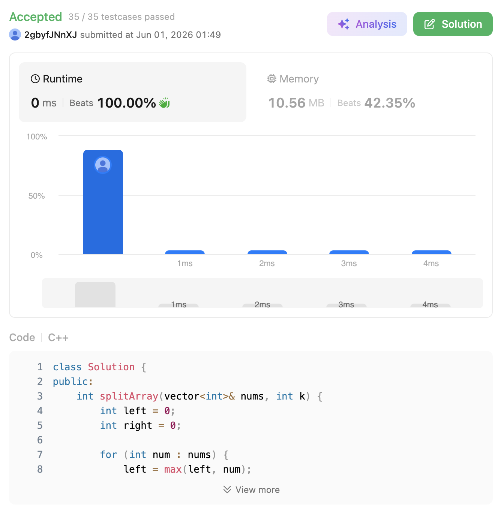

# 410. Split Array Largest Sum (Hard)

### 題目說明

給定一個包含非負整數的陣列 `nums` 和一個整數 $k$，請將這個陣列分割成 $k$ 個非空的連續子陣列。
我們的目標是：找出所有的分割方案中，**「子陣列和的最大值」最小**可以是多少？

### 解題邏輯：對答案進行二分搜尋 (Binary Search on Answer)

這題若直接用動態規劃（DP）思考，時間複雜度會高達 $O(k \cdot n^2)$，對於較大的資料量會 TLE。但我們如果逆向思考：「如果我猜一個最大和的上限 $M$，我有辦法驗證它是否合法嗎？」這就是二分搜尋法對答案搜值的核心精神。

1. **確定搜尋的邊界 (Search Space)**：
* **下界 (`left`)**：在極端情況下（ $k = n$），陣列被切碎成每人一個，此時「最大子陣列和」就是陣列中的**最大元素**。
* **上界 (`right`)**：在另一個極端情況下（ $k = 1$），完全不切，此時「最大子陣列和」就是陣列**所有元素的總和**。
* 最終答案必定落在 `[left, right]` 這個閉區間內。


2. **單調性與貪婪判定 (Greedy Validation)**：
* 假設我們猜一個目標上限值 `mid`。我們從左到右貪婪地把數字加入當前的子陣列，只要總和不超過 `mid` 就繼續加；一旦超過，就從這個數字開始切出「下一個」新的子陣列。
* 遍歷結束後，如果切出的子陣列數量 $\le k$，代表這個 `mid` 是一個合法的上限（甚至可能還有更緊的空間），我們就把上界縮小（`right = mid - 1`）。
* 如果切出的數量 $> k$，代表 `mid` 設得太嚴苛了，導致我們被迫切出太多塊，因此必須放寬條件，把下界提高（`left = mid + 1`）。


3. **最優性證明**：利用二分搜尋的特性，當 `left` 與 `right` 交錯時，`left` 所指的位置即為滿足判定條件的「最小合法極值」。

### 複雜度分析

* **時間複雜度**： $O(N \log S)$。其中 $N$ 是 `nums` 的長度，$S$ 是陣列元素的總和（上界與下界的差值）。每次二分搜尋需要 $O(N)$ 的時間來做貪婪掃描，二分搜尋會執行 $\log S$ 次。
* **空間複雜度**： $O(1)$。只需要常數個變數來記錄指標與當前總和，不需要額外開陣列。

### 程式碼實作 (C++)

```cpp
class Solution {
public:
    int splitArray(vector<int>& nums, int k) {
        int left = 0;
        int right = 0;
        
        // 1. 找出二分搜尋的下界與上界
        for (int num : nums) {
            left = max(left, num);
            right += num;
        }
        
        // 2. 對可能的最大和進行二分搜尋
        while (left <= right) {
            int mid = left + (right - left) / 2;
            
            // 判斷當前猜測的上限 mid 是否能用至多 k 刀切完
            if (isValid(nums, k, mid)) {
                right = mid - 1;  // 可以切完，嘗試找更小的「最大和」
            } else {
                left = mid + 1;   // 切不完（需要太多塊），必須提高上限
            }
        }
        
        return left;
    }

private:
    // 貪婪法檢查函式：在子陣列和不超過 targetSum 的情況下，需要切幾塊？
    bool isValid(const vector<int>& nums, int k, int targetSum) {
        int currentSum = 0;
        int count = 1; // 至少會有一個子陣列
        
        for (int num : nums) {
            if (currentSum + num > targetSum) {
                count++;            // 切一刀，開啟新的子陣列
                currentSum = num;   // 新子陣列的第一個元素
                
                // 如果需要的子陣列數量已經超過 k，直接判定失敗
                if (count > k) {
                    return false;
                }
            } else {
                currentSum += num;  // 還沒超過，繼續塞入當前子陣列
            }
        }
        return true;
    }
};
```
 
