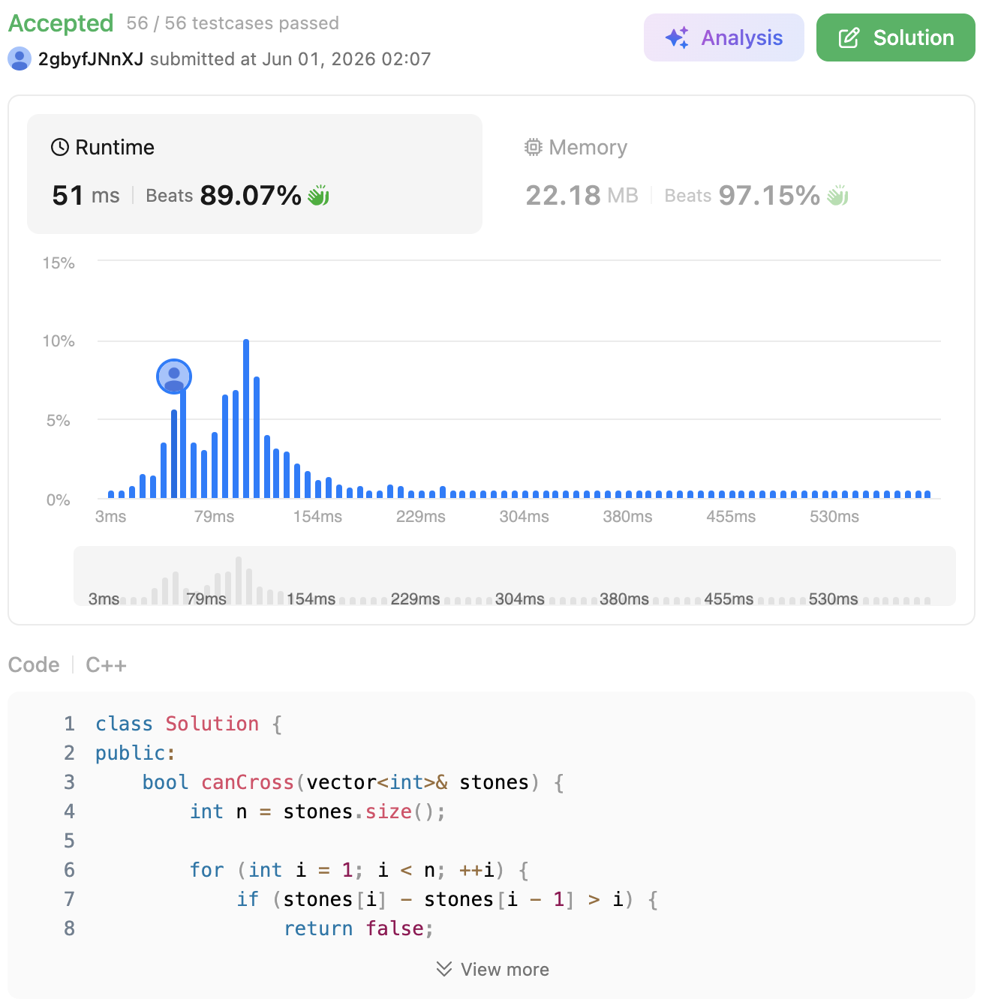

# 403. Frog Jump (Hard)

### 題目說明

一隻青蛙想要過河，河中有一排位置呈嚴格遞增的石頭 `stones`。青蛙一開始在第一塊石頭上（索引為 0），且第一步強制只能跳 1 個單位。
規則是：如果青蛙上一步跳了 $k$ 個單位，那牠下一步只能跳 $k-1$、 $k$ 或 $k+1$ 個單位，且只能往前跳（步長 $>0$）。
請判斷青蛙能否順利跳到最後一塊石頭上？

### 解題邏輯：動態規劃與狀態維度擴充 (Dynamic Programming)

若只用一維 DP 記錄「能否到達石頭 $i$」是不夠的，因為這無法推導下一步的合法範圍。因此，我們需要引入「步長」作為第二個狀態維度。

1. **狀態定義**：
* 建立一個二維布林陣列 `dp[i][k]`，代表「青蛙能否透過跨出長度為 $k$ 的步伐，精準降落在第 $i$ 塊石頭上」。


2. **狀態邊界分析與降維 (Dimension Bounding)**：
* 這是本題最精妙的數學性質：青蛙在第 1 步最大步長為 1，第 2 步最大步長為 2……依此類推。這意味著**跳到第 $j$ 塊石頭時，其最大可能步長不會超過 $j + 1$**。
* 有了這個極限值，我們的 `k` 不需要開到跟石頭座標一樣大，只需要開到與石頭數量 $N$ 相同即可，完美將空間複雜度壓縮至 $O(N^2)$。


3. **狀態轉移與早期剪枝**：
* 初始狀態：`dp[0][0] = true`（站在第 0 塊石頭，假裝前一步長度為 0）。
* 對於每一塊石頭 $i$，我們回頭看它前面的所有石頭 $j$（從 $i-1$ 往回推）。
* 計算距離 $k = stones[i] - stones[j]$。如果 $k > j + 1$，代表從石頭 $j$ 根本跳不到 $i$（因為距離超過了青蛙在石頭 $j$ 能展現的極限能力），此時可以直接 `break` 掉內層迴圈。
* 如果距離合法，我們就檢查在石頭 $j$ 時，是否有 $k-1, k, k+1$ 這三種步長其中之一的狀態為 `true`。只要有一個成立，`dp[i][k]` 就為 `true`。


4. **終止條件**：在計算過程中，只要有任何一個 `dp[n-1][k]` 被設為 `true`，就代表成功抵達終點，直接回傳 `true` 即可。

### 複雜度分析

* **時間複雜度**： $O(N^2)$。其中 $N$ 是石頭的數量。雙層迴圈遍歷所有石頭組合，由於內部有嚴格的剪枝條件（`k > j + 1`），實際執行次數遠小於 $N^2/2$。
* **空間複雜度**： $O(N^2)$。我們使用了一個大小為 $N \times (N+1)$ 的二維布林陣列來儲存 DP 狀態。

### 程式碼實作 (C++)

```cpp
class Solution {
public:
    bool canCross(vector<int>& stones) {
        int n = stones.size();
        
        // 早期剪枝：由於第 i 步最大步長只能是 i
        // 如果相鄰石頭距離增加太快，青蛙絕對跳不過去
        for (int i = 1; i < n; ++i) {
            if (stones[i] - stones[i - 1] > i) {
                return false;
            }
        }
        
        // dp[i][k] 代表：能否以步長 k 跳到第 i 塊石頭
        vector<vector<bool>> dp(n, vector<bool>(n + 1, false));
        dp[0][0] = true;
        
        for (int i = 1; i < n; ++i) {
            // 從前面的石頭往後嘗試跳到 i，倒著找可以更快觸發剪枝
            for (int j = i - 1; j >= 0; --j) {
                int k = stones[i] - stones[j];
                
                // 數學極限：從第 j 塊石頭起跳，最大極限步長不會超過 j + 1
                if (k > j + 1) {
                    break; // 如果連極限都搆不到，更前面的石頭一定更搆不到
                }
                
                // 狀態轉移：檢查青蛙在石頭 j 上，是否能跳出步長 k
                // 條件是：到達石頭 j 時的步長必須是 k-1, k 或 k+1
                if (dp[j][k - 1] || dp[j][k] || dp[j][k + 1]) {
                    dp[i][k] = true;
                    
                    // 如果這一步剛好跳到了終點，直接判定成功
                    if (i == n - 1) {
                        return true;
                    }
                }
            }
        }
        
        return false;
    }
};
```
 
