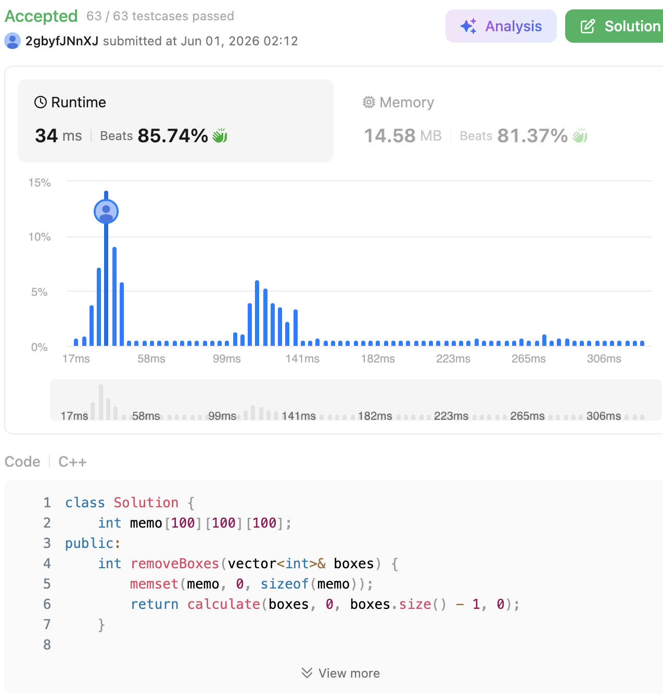

# 546. Remove Boxes (Hard)

### 題目說明

給定一個代表不同顏色盒子的陣列 `boxes`。你可以不斷執行以下操作直到盒子被清空：
每次選擇一段**連續且顏色相同**的盒子（假設長度為 $k$）並將其移除，你可以獲得 $k^2$ 的分數。
移除後，原本在該段盒子左右兩邊的盒子會靠攏相連。請計算你能獲得的**最大總積分**。

### 解題邏輯：狀態維度擴充與記憶化深度優先搜尋 (Memoized DFS with 3D State)

如果我們只用標準的區間 DP `dp[l][r]` 代表區間 `[l, r]` 的最大分數，會遇到致命問題：**中間的盒子被消除後，左右兩邊相同顏色的盒子會合併，分數 $(k_1+k_2)^2 > k_1^2 + k_2^2$**。這代表區間 `[l, r]` 的最佳解，會受到「區間外部」有沒有同色盒子在等著跟它合併所影響。

為了解決這個未來依賴的問題，我們必須引入第三個維度 `k`。

1. **狀態定義**：
定義 `dp(l, r, k)` 表示：處理區間 `[l, r]`，且在 `boxes[r]` 的右邊，**已經有 $k$ 個與 `boxes[r]` 顏色相同的盒子等著跟它一起消除**時，所能獲得的最大分數。
2. **貪婪剪枝 (Greedy Pruning)**：
在開始計算 `dp(l, r, k)` 之前，我們先把右邊連續相同顏色的盒子全部算進來。也就是說，如果 `boxes[r] == boxes[r-1]`，我們可以直接讓 `r--` 且 `k++`。這是一個必做的貪婪選擇，因為把它們綁在一起消除一定比分開消除好。
3. **狀態轉移決策**：
面對更新後的 `boxes[r]` 與它右邊累積的 `k` 個同色盒子，我們有兩種決策：
* **策略 A (直接消除)**：不等了，直接把 `boxes[r]` 和右邊的 `k` 個盒子一起消掉。獲得的分數為 $(k+1)^2$。剩下的區間變成 `dp(l, r-1, 0)`。
* **策略 B (隔山打牛/尋找隊友)**：在前面的區間 `[l, r-1]` 中，尋找有沒有哪個盒子 `boxes[i]` 的顏色跟 `boxes[r]` 一樣。如果有，我們可以先「優先把區間 `[i+1, r-1]` 給全部消掉」，這樣 `boxes[i]` 就會和 `boxes[r]` 以及那 `k` 個盒子接在一起了！
此時的分數為：`dp(i+1, r-1, 0)` (消去中間障礙的分數) + `dp(l, i, k+1)` (合併後的遞迴分數)。
* 我們遍歷所有可能的 $i$，取上述策略的最大值。


### 複雜度分析

* **時間複雜度**： $O(N^4)$。區間長度 $N$ 最大為 100。狀態有 $l, r, k$ 三個維度，共 $O(N^3)$ 個狀態。計算每個狀態時，需要一個 $O(N)$ 的迴圈來尋找斷點 $i$。雖然理論上界是 $O(N^4)$，但透過貪婪剪枝與記憶化，實際會探訪的無效狀態極少，執行速度非常快。
* **空間複雜度**： $O(N^3)$。我們需要一個 $100 \times 100 \times 100$ 的三維陣列來儲存記憶化結果（Memoization），空間開銷完全在可接受範圍內。

### 程式碼實作 (C++)

```cpp
class Solution {
    int memo[100][100][100];
public:
    int removeBoxes(vector<int>& boxes) {
        memset(memo, 0, sizeof(memo));
        return calculate(boxes, 0, boxes.size() - 1, 0);
    }

private:
    int calculate(vector<int>& boxes, int l, int r, int k) {
        if (l > r) return 0;
        if (memo[l][r][k] != 0) return memo[l][r][k];

        // 貪婪剪枝：把右邊連續且顏色相同的盒子先綁在一起
        int orig_r = r;
        int orig_k = k;
        while (l < r && boxes[r] == boxes[r - 1]) {
            r--;
            k++;
        }

        // 策略 A：直接將目前的 boxes[r] 與右邊累積的 k 個盒子一起消除
        int res = (k + 1) * (k + 1) + calculate(boxes, l, r - 1, 0);

        // 策略 B：在區間 [l, r-1] 中尋找跟 boxes[r] 同色的隊友
        for (int i = l; i < r; i++) {
            if (boxes[i] == boxes[r]) {
                // 先消除 [i+1, r-1] 區間的障礙，讓 boxes[i] 銜接上 boxes[r] 與右邊的 k 個盒子
                int merge_score = calculate(boxes, i + 1, r - 1, 0) + calculate(boxes, l, i, k + 1);
                res = max(res, merge_score);
            }
        }

        // 儲存結果並回傳 (注意要儲存在最原始的 orig_r 與 orig_k 狀態中)
        return memo[l][orig_r][orig_k] = res;
    }
};
```
 
