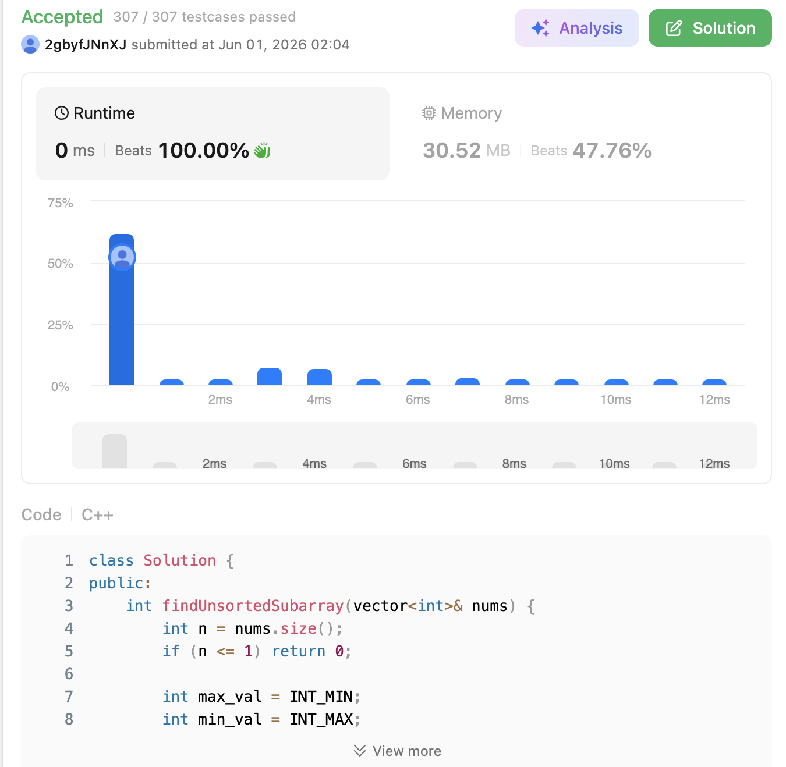

# 581. Shortest Unsorted Continuous Subarray (Medium)

### 題目說明

給定一個整數陣列 `nums`，你需要找出一個「連續子陣列」，如果只對這個子陣列進行升序排序，那麼整個原本的陣列也會變成升序排序。請找出並回傳這個子陣列的「最短」長度。

### 解題邏輯：雙向掃描尋找破壞邊界 (Two-way Scan for Disordered Boundaries)

要在 $O(N)$ 的時間內解決這個問題，我們可以利用「最大值」與「最小值」的傳遞特性。如果一個陣列是完全升序的，那麼任何一個元素都應該大於或等於它左邊的所有元素，且小於或等於它右邊的所有元素。

1. **尋找右邊界 (`right`)**：
* 從左到右掃描陣列，同時維護一個變數 `max_val` 來記錄目前為止遇到的最大值。
* 如果當前元素 `nums[i] < max_val`，代表 `nums[i]` 位於一個比它大的數字的右邊，這是「反常」的（違反升序規則），因此 `nums[i]` 必定需要被重新排序。
* 我們一路掃描到最後，**最後一個**發生這種「反常」現象的索引，就是未排序子陣列的右邊界。


2. **尋找左邊界 (`left`)**：
* 同理，從右到左掃描陣列，維護一個變數 `min_val` 來記錄目前為止遇到的最小值。
* 如果當前元素 `nums[i] > min_val`，代表 `nums[i]` 位於一個比它小的數字的左邊，這也是反常的。
* 一路掃描到最前面，**最後一個**（也就是最左邊的）發生反常現象的索引，就是未排序子陣列的左邊界。


3. **特例判定**：
* 如果掃描結束後，發現邊界沒有被更新過，代表陣列原本就已經是完美升序，直接回傳 `0`。否則回傳區間長度 `right - left + 1`。


### 複雜度分析

* **時間複雜度**： $O(N)$。我們只需要對陣列進行兩次獨立的線性掃描（從左到右一次、從右到左一次），時間開銷與陣列長度成正比。
* **空間複雜度**： $O(1)$。僅使用了常數個變數（`max_val`, `min_val`, `left`, `right`）來記錄狀態。

### 程式碼實作 (C++)

```cpp
class Solution {
public:
    int findUnsortedSubarray(vector<int>& nums) {
        int n = nums.size();
        if (n <= 1) return 0;
        
        int max_val = INT_MIN;
        int min_val = INT_MAX;
        int right = -1;
        int left = -1;
        
        // 1. 從左向右掃描，找右邊界
        // 維護遇到的最大值，若當前值小於最大值，代表當前值的位置不對
        for (int i = 0; i < n; ++i) {
            if (nums[i] < max_val) {
                right = i;
            } else {
                max_val = nums[i];
            }
        }
        
        // 如果 right 沒被更新，代表整個陣列原本就有序
        if (right == -1) return 0;
        
        // 2. 從右向左掃描，找左邊界
        // 維護遇到的最小值，若當前值大於最小值，代表當前值的位置不對
        for (int i = n - 1; i >= 0; --i) {
            if (nums[i] > min_val) {
                left = i;
            } else {
                min_val = nums[i];
            }
        }
        
        // 回傳需要排序的子陣列長度
        return right - left + 1;
    }
};
```
 
