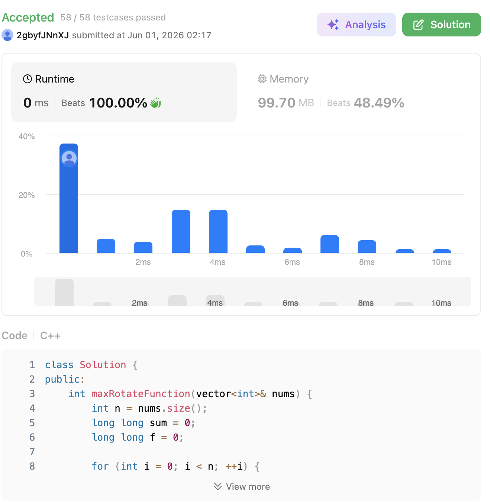

# 396. Rotate Function (Medium)

### 題目說明

給定一個長度為 $n$ 的整數陣列 `nums`。
定義一個旋轉函數 $F(k)$，代表將陣列向右循環移動 $k$ 次後，每個元素的值乘上其對應的索引值（$0 \times arr[0] + 1 \times arr[1] + \dots$）的總和。
請找出在所有可能的旋轉中，$F(k)$ 的**最大值**是多少？

### 解題邏輯：數學降維與狀態轉移 (Mathematical Derivation & State Transition)

這題的精髓在於觀察 $F(k)$ 與 $F(k-1)$ 之間的數學關聯。我們不要每次都重新算，而是用「前一次的結果」推導出「下一次的結果」。

1. **展開與觀察**：
假設陣列總和為 $S = nums[0] + nums[1] + \dots + nums[n-1]$。
$F(0) = 0 \cdot nums[0] + 1 \cdot nums[1] + 2 \cdot nums[2] + \dots + (n-1) \cdot nums[n-1]$
向右旋轉一次後：
$F(1) = 0 \cdot nums[n-1] + 1 \cdot nums[0] + 2 \cdot nums[1] + \dots + (n-1) \cdot nums[n-2]$
2. **尋找差值 (Difference)**：
我們將 $F(1) - F(0)$ 兩式相減：
$F(1) - F(0) = nums[0] + nums[1] + \dots + nums[n-2] - (n-1) \cdot nums[n-1]$
為了讓等式更漂亮，我們可以在右邊加上 $nums[n-1]$ 再減去 $nums[n-1]$：
$F(1) - F(0) = (nums[0] + \dots + nums[n-2] + nums[n-1]) - n \cdot nums[n-1]$
$F(1) - F(0) = S - n \cdot nums[n-1]$
3. **推導出通式 (General Formula)**：
進一步推廣，每次向右旋轉 1 步，相當於把所有元素的索引值都加 1（也就是總和增加了 $S$），但原本在最後一個位置（索引 $n-1$）的元素會跑到最前面（索引 0），它的乘數從 $n-1$ 變成 $0$，因此要扣掉 $n \times$ 該元素的值。
得到終極轉移方程式：**$F(k) = F(k-1) + S - n \cdot nums[n-k]$**
4. **迭代求解**：
先用 $O(N)$ 算出 $S$ 與 $F(0)$，接著只要用一個迴圈跑 $N-1$ 次狀態轉移，並在過程中更新最大值即可。

### 複雜度分析

* **時間複雜度**： $O(N)$。只需遍歷陣列兩次：第一次計算總和 $S$ 與 $F(0)$，第二次計算所有的 $F(k)$，完美避開了 $O(N^2)$ 的暴力解。
* **空間複雜度**： $O(1)$。僅使用了常數個變數（`sum`, `f`, `max_val`），無需額外配置記憶體。

### 程式碼實作 (C++)

```cpp
class Solution {
public:
    int maxRotateFunction(vector<int>& nums) {
        int n = nums.size();
        long long sum = 0; // 陣列元素總和
        long long f = 0;   // 記錄當前的 F(k)
        
        // 1. 計算 S (sum) 與初始狀態 F(0)
        for (int i = 0; i < n; ++i) {
            sum += nums[i];
            f += (long long)i * nums[i]; 
            // 使用 long long 防止乘法過程溢位
        }
        
        long long max_val = f;
        
        // 2. 利用狀態轉移方程式計算 F(1) 到 F(n-1)
        // 當 k=1 時，移動到最前面的是 nums[n-1]
        // 當 k=2 時，移動到最前面的是 nums[n-2]... 依此類推
        for (int i = n - 1; i > 0; --i) {
            f = f + sum - (long long)n * nums[i];
            max_val = max(max_val, f);
        }
        
        // 題目保證答案在 32-bit int 範圍內
        return (int)max_val; 
    }
};
```
 
