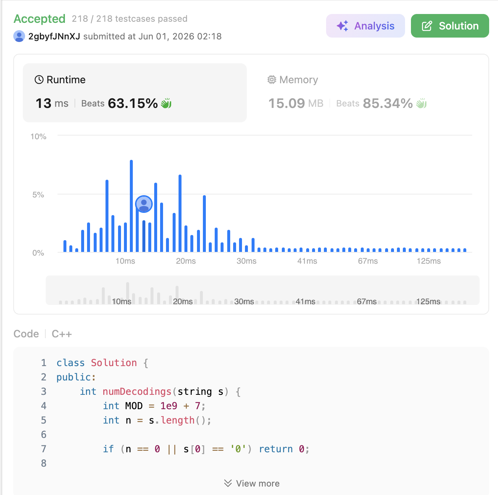

# 639. Decode Ways II (Hard)

### 題目說明

一條包含大寫字母 A-Z 的訊息被編碼為數字，規則是 'A' -> 1, 'B' -> 2, ..., 'Z' -> 26。
除了數字之外，字串 `s` 中可能包含萬用字元 `'*'`，它代表從 1 到 9 的**任何一個數字**（注意：不包含 0）。
給定一個包含數字與 `'*'` 的字串 `s`，請計算出所有可能的解碼方式總數。因為答案可能非常大，請將結果對 $10^9 + 7$ 取餘數（Modulo）。

### 解題邏輯：動態規劃與排列組合展開 (Dynamic Programming with Combinatorics)

令 `dp[i]` 代表字串前 $i$ 個字元的解碼方法總數。對於第 $i$ 個字元，我們有兩種解碼策略：**單字元解碼**與**雙字元解碼**。

1. **單字元解碼 (看 `s[i]`)**：
* 如果 `s[i] == '*'`，它可以是 1~9，所以提供 $9 \times dp[i-1]$ 種方法。
* 如果 `s[i]` 是 '1'~'9'，提供 $1 \times dp[i-1]$ 種方法。
* 如果 `s[i] == '0'`，單字元無法解碼，提供 $0$ 種方法。


2. **雙字元解碼 (看 `s[i-1]` 與 `s[i]`)**：
* 如果 `s[i-1] == '*'`：
* `s[i] == '*'` (``)：可以組成 11~19 (9種) 與 21~26 (6種)，共 $15 \times dp[i-2]$ 種。
* `s[i]` 是數字：若 $\le 6$，可以是 1x 或 2x (共 2 種)；若 $> 6$，只能是 1x (共 1 種)。


* 如果 `s[i-1] == '1'`：
* 無論 `s[i]` 是 `*` 或數字，都能穩定組成 11~19 或 10~19，`*` 貢獻 9 種，數字貢獻 1 種。


* 如果 `s[i-1] == '2'`：
* 若 `s[i] == '*'`，可以組成 21~26，貢獻 6 種。
* 若 `s[i]` 是數字且 $\le 6$，貢獻 1 種；否則貢獻 0 種。


3. **空間降維優化 (Space Optimization)**：
* 我們發現 `dp[i]` 永遠只依賴 `dp[i-1]` 與 `dp[i-2]`，這意味著我們不需要宣告一個長度為 $O(N)$ 的陣列，只需維護兩個變數 `dp0` 與 `dp1`，即可將空間複雜度從 $O(N)$ 降維至 $O(1)$。


### 複雜度分析

* **時間複雜度**： $O(N)$。我們只需要線性遍歷字串一次，每次轉移的計算都是常數級別的條件判斷。
* **空間複雜度**： $O(1)$。利用狀態壓縮技術，只使用了常數個 `long long` 變數來記錄前兩步的狀態。

### 程式碼實作 (C++)

```cpp
class Solution {
public:
    int numDecodings(string s) {
        int MOD = 1e9 + 7;
        int n = s.length();
        
        if (n == 0 || s[0] == '0') return 0;
        
        // dp0 代表 dp[i-2], dp1 代表 dp[i-1]
        long long dp0 = 1;
        long long dp1 = (s[0] == '*') ? 9 : 1;
        
        for (int i = 1; i < n; i++) {
            long long dp2 = 0; // dp2 代表目前的 dp[i]
            
            // 1. 單字元解碼邏輯
            if (s[i] == '*') {
                dp2 = (dp2 + 9 * dp1) % MOD;
            } else if (s[i] > '0') {
                dp2 = (dp2 + dp1) % MOD;
            }
            
            // 2. 雙字元解碼邏輯
            if (s[i - 1] == '*') {
                if (s[i] == '*') {
                    dp2 = (dp2 + 15 * dp0) % MOD; // 11-19 (9種) + 21-26 (6種)
                } else if (s[i] <= '6') {
                    dp2 = (dp2 + 2 * dp0) % MOD;  // 例如 *3 可以是 13 或 23
                } else {
                    dp2 = (dp2 + dp0) % MOD;      // 例如 *7 只能是 17
                }
            } else if (s[i - 1] == '1') {
                if (s[i] == '*') {
                    dp2 = (dp2 + 9 * dp0) % MOD;  // 11-19
                } else {
                    dp2 = (dp2 + dp0) % MOD;      // 10-19
                }
            } else if (s[i - 1] == '2') {
                if (s[i] == '*') {
                    dp2 = (dp2 + 6 * dp0) % MOD;  // 21-26
                } else if (s[i] <= '6') {
                    dp2 = (dp2 + dp0) % MOD;      // 20-26
                }
            }
            
            // 狀態推進
            dp0 = dp1;
            dp1 = dp2;
        }
        
        return dp1;
    }
};
```
 
