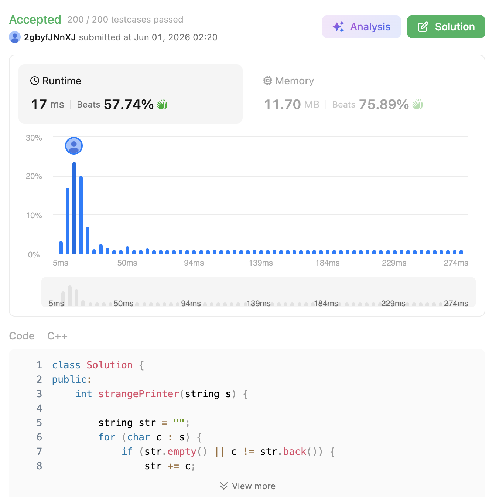

# 664. Strange Printer (Hard)

### 題目說明

有一台奇怪的印表機，它每次只能印出一連串「完全相同」的字元。
每次列印時，它可以從字串的任意位置開始，到任意位置結束，並且新的列印會**直接覆蓋**掉該區間原本存在的字元。
給定一個字串 `s`，請問最少需要「幾次列印」才能印出該字串？

### 解題邏輯：字串壓縮與區間動態規劃 (String Compression & Interval DP)

這題的核心思維是：**如果區間兩端的字元相同，我們可以在印其中一端時，順便一路印到另一端，這樣就不會增加額外的列印次數。**

1. **字串壓縮優化 (String Compression)**：
* 印表機印出一個 `'a'` 和印出一排 `'aaaaa'` 所花費的次數是一樣的（都是 1 次）。因此，我們可以先將字串中「連續相同的字元」壓縮成一個字元（例如 `"aaabbba"` 變成 `"aba"`），這能大幅降低 DP 的計算維度與執行時間。


2. **狀態定義**：
* 定義 `dp[i][j]` 表示印出子字串 `s[i...j]` 所需的最少列印次數。


3. **區間狀態轉移 (State Transition)**：
我們從小區間（長度為 1）開始往大區間推導：
* **Base Case**：`dp[i][i] = 1`（單一字元需要印 1 次）。
* **情境一：頭尾字元相同 (`s[i] == s[j]`)**
如果在區間 `[i, j]` 中，最左邊和最右邊的字元一樣，代表我們在印 `s[i]` 的時候，大可直接一口氣印到 `j` 的位置。之後不管中間被覆蓋成什麼樣子，都不會增加對 `s[j]` 的列印成本。
因此：`dp[i][j] = dp[i][j - 1]` （或是等價於 `dp[i+1][j]`）。
* **情境二：頭尾字元不同 (`s[i] != s[j]`)**
如果頭尾不同，我們就必須把區間 `[i, j]` 切切看，找一個最棒的斷點 `k`（$i \le k < j$），將問題拆分成兩半 `[i, k]` 與 `[k+1, j]`，並且把兩邊的最少次數相加。
因此：`dp[i][j] = min(dp[i][k] + dp[k+1][j])`。


### 複雜度分析

* **時間複雜度**： $O(N^3)$。其中 $N$ 是「壓縮後」的字串長度。外層有兩個迴圈決定區間長度與起點，內層有一個迴圈尋找斷點 $k$。因為我們做了字串壓縮，實際執行時 $N$ 會遠小於原字串長度，速度極快。
* **空間複雜度**： $O(N^2)$。使用了一個 $N \times N$ 的二維陣列來儲存 DP 狀態。

### 程式碼實作 (C++)

```cpp
class Solution {
public:
    int strangePrinter(string s) {
        // 1. 字串壓縮：將連續相同的字元壓縮成單一字元
        string str = "";
        for (char c : s) {
            if (str.empty() || c != str.back()) {
                str += c;
            }
        }
        
        int n = str.length();
        if (n == 0) return 0;
        
        // dp[i][j] 代表印出 str[i..j] 的最少次數
        vector<vector<int>> dp(n, vector<int>(n, 0));
        
        // 2. 區間 DP (由底向上，由短區間到長區間)
        for (int i = n - 1; i >= 0; --i) {
            dp[i][i] = 1; // 單一字元需要印 1 次
            
            for (int j = i + 1; j < n; ++j) {
                if (str[i] == str[j]) {
                    // 如果頭尾字元相同，尾部的字元可以跟著頭部一起印，不增加次數
                    dp[i][j] = dp[i][j - 1];
                } else {
                    // 如果頭尾不同，窮舉所有的切分點 k，找最小值
                    dp[i][j] = INT_MAX;
                    for (int k = i; k < j; ++k) {
                        dp[i][j] = min(dp[i][j], dp[i][k] + dp[k + 1][j]);
                    }
                }
            }
        }
        
        return dp[0][n - 1];
    }
};
```
 
