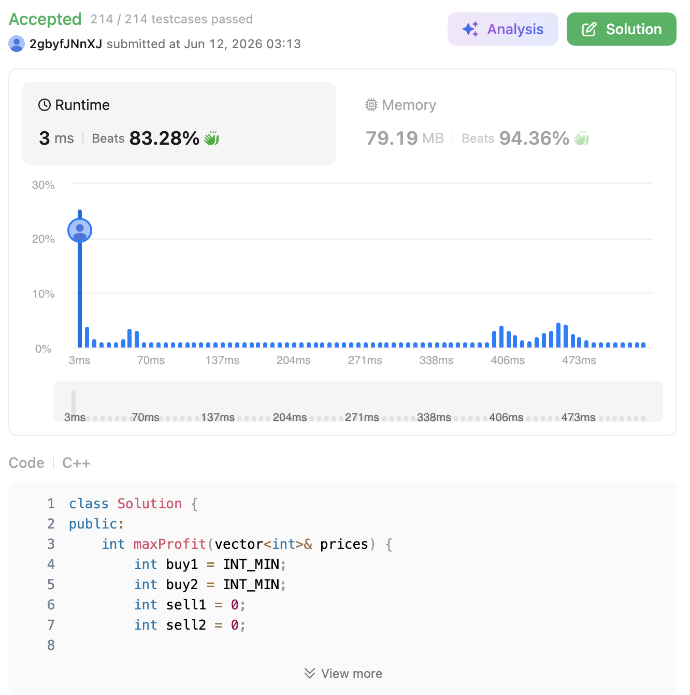

# 123. Best Time to Buy and Sell Stock III (Hard)

### 題目說明

給定一個陣列 `prices`，其中 `prices[i]` 是一支給定股票在第 $i$ 天的價格。
請設計一個演算法來計算你能獲取的最大利潤。你最多可以完成 **兩筆** 交易。
（注意：你不能同時參與多筆交易，也就是說，你必須在再次購買前出售掉手上的股票）。

### 解題邏輯：狀態機動態規劃 (State Machine DP)

既然你之前沒寫過，我們直接切入期末考範圍「動態規劃 (Dynamic Programming)」中最優雅的解法：狀態機。因為最多只能交易兩次，我們可以將「每一天結束後手上的資金狀態」分為四種，並隨著時間推移不斷更新這些狀態的「最大值」。

1. **狀態定義**：
* `buy1`：第一次買入後，手上的資金（因為是花錢買，所以初始化為極小值，目標是花最少的成本，亦即讓 `buy1` 越大越好）。
* `sell1`：第一次賣出後，手上的資金（也就是第一次交易的最大利潤）。
* `buy2`：第二次買入後，手上的資金（用第一次賺的利潤 `sell1` 去扣掉第二次買入的成本）。
* `sell2`：第二次賣出後，手上的資金（兩次完整交易後的最終最大利潤）。

2. **狀態轉移 (State Transition)**：
* 每天遇到一個新的價格 `price` 時，我們都嘗試更新這四個狀態：
  * `buy1 = max(buy1, -price)`：比較「之前就買好第一張」跟「今天才買第一張」，保留較大的淨值。
  * `sell1 = max(sell1, buy1 + price)`：比較「之前就賣出第一張」跟「今天才賣出第一張」，保留較大的利潤。
  * `buy2 = max(buy2, sell1 - price)`：比較「之前就買好第二張」跟「今天用 `sell1` 的錢買第二張」，保留較大的淨值。
  * `sell2 = max(sell2, buy2 + price)`：比較「之前就賣出第二張」跟「今天賣出第二張」，保留最終的最大總利潤。

### 複雜度分析

* **時間複雜度**： $O(N)$。其中 $N$ 是 `prices` 陣列的長度。只需從頭到尾線性遍歷一次價格陣列。
* **空間複雜度**： $O(1)$。我們運用了滾動陣列的概念，只用了四個常數變數來記錄當前狀態，完全捨棄了建構 $O(N)$ 的 DP 表格，極大地節省了記憶體。

### 程式碼實作 (C++)

```cpp
class Solution {
public:
    int maxProfit(vector<int>& prices) {
        int buy1 = INT_MIN;
        int buy2 = INT_MIN;
        int sell1 = 0;
        int sell2 = 0;
        
        // 核心 DP 狀態轉移
        for (int price : prices) {
            buy1 = max(buy1, -price);
            sell1 = max(sell1, buy1 + price);
            buy2 = max(buy2, sell1 - price);
            sell2 = max(sell2, buy2 + price);
        }
        
        // sell2 會自動涵蓋只交易一次的最高利潤（如果第二次交易不划算，數值會維持）
        return sell2;
    }
};
```

