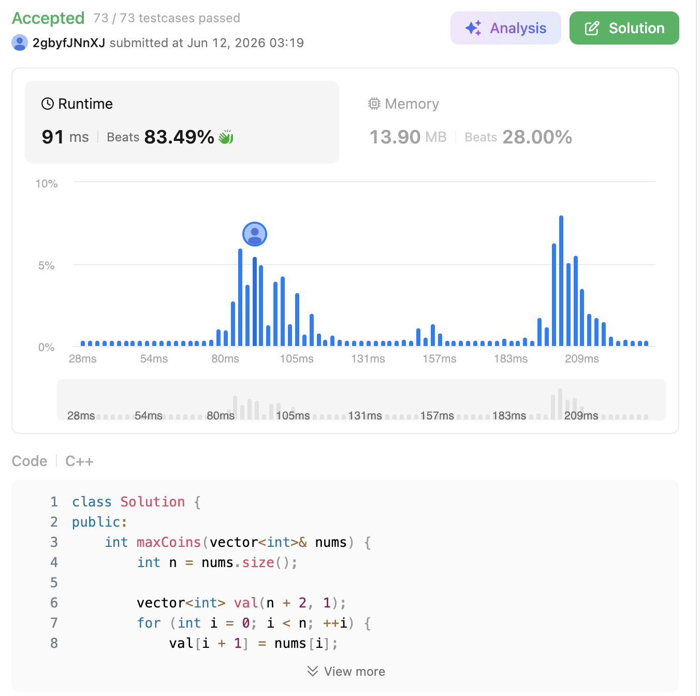

# 312. Burst Balloons (Hard)

### 題目說明

給定 $n$ 個氣球，標號從 $0$ 到 $n-1$，每個氣球上都有一個數字，用陣列 `nums` 表示。
你被要求戳破所有的氣球。每當你戳破氣球 `i` 時，你可以獲得 `nums[i - 1] * nums[i] * nums[i + 1]` 枚硬幣。
如果 `i - 1` 或 `i + 1` 超出了陣列的邊界，則將它們視為數字為 $1$ 的虛擬氣球。
請計算出你能獲得的「最大硬幣數量」。

### 解題邏輯：逆向思考與區間動態規劃 (Interval DP)

這題是極度經典的「區間 DP」問題。如果我們「順向思考」（枚舉哪一個氣球先被戳破），氣球戳破後陣列會收縮，原本不相鄰的兩個氣球會突然變成相鄰的，導致子問題之間產生嚴重的依賴性（違反了 DP 的無後效性）。

**核心直覺：逆向思考 (Reverse Thinking)**
與其去想「哪一個氣球先被戳破」，不如去想：**「哪一個氣球是『最後一個』被戳破的？」**
假設在一個開區間 $(i, j)$ 中，我們決定讓氣球 $k$ 成為該區間內**最後一個**被戳破的氣球。
那麼，在戳破 $k$ 的那個瞬間，區間內除了 $k$ 以外的所有氣球肯定都已經破光了！因此，此時 $k$ 左邊相鄰的氣球必定是邊界 $i$，右邊相鄰的氣球必定是邊界 $j$。

1. **陣列重構 (Padding)**：
* 為了處理邊界條件，我們在原本的 `nums` 陣列前後各補上一個 $1$，建構一個新的陣列 `val`。

2. **狀態定義**：
* 定義 `dp[i][j]` 為：戳破開區間 **$(i, j)$ 內部**的所有氣球，所能獲得的最大硬幣總數。（注意：不包含戳破 $i$ 和 $j$ 本身）。

3. **狀態轉移方程 (State Transition)**：
* 對於區間 $(i, j)$，我們枚舉區間內的每一個氣球 $k$（$i < k < j$），假設 $k$ 是這個區間內「最後一個」被戳破的。
* 既然 $k$ 是最後破的，那 $k$ 就把原區間完美且獨立地分割成了左右兩個子區間 $(i, k)$ 與 $(k, j)$。
* 轉移式：`dp[i][j] = max(dp[i][j], dp[i][k] + dp[k][j] + val[i] * val[k] * val[j])`。

### 複雜度分析

* **時間複雜度**： $O(N^3)$。其中 $N$ 是補上邊界後的陣列長度。我們需要 $O(N^2)$ 的時間來枚舉所有可能的區間狀態（長度由小到大），而在每個區間內，又需要 $O(N)$ 的時間來枚舉最後一個被戳破的氣球 $k$。
* **空間複雜度**： $O(N^2)$。需要一個大小為 $(N+2) \times (N+2)$ 的二維 DP 表格來記錄所有子區間的最佳解。

### 程式碼實作 (C++)

```cpp
class Solution {
public:
    int maxCoins(vector<int>& nums) {
        int n = nums.size();
        
        // 1. 建立新的陣列，前後補 1 以處理邊界
        vector<int> val(n + 2, 1);
        for (int i = 0; i < n; ++i) {
            val[i + 1] = nums[i];
        }
        
        // dp[i][j] 代表戳破開區間 (i, j) 內所有氣球的最大得分
        vector<vector<int>> dp(n + 2, vector<int>(n + 2, 0));
        
        // 2. 區間 DP，必須先從小區間開始推導 (len 是區間長度，至少為 3 才有中間氣球可戳)
        for (int len = 3; len <= n + 2; ++len) {
            // 決定區間的左邊界 i
            for (int i = 0; i <= n + 2 - len; ++i) {
                int j = i + len - 1; // 根據長度算出右邊界 j
                
                // 3. 枚舉區間 (i, j) 中「最後一個」戳破的氣球 k
                for (int k = i + 1; k < j; ++k) {
                    dp[i][j] = max(dp[i][j], dp[i][k] + dp[k][j] + val[i] * val[k] * val[j]);
                }
            }
        }
        
        // 回傳戳破 (0, n + 1) 內所有氣球的最大分數
        return dp[0][n + 1];
    }
};
```

