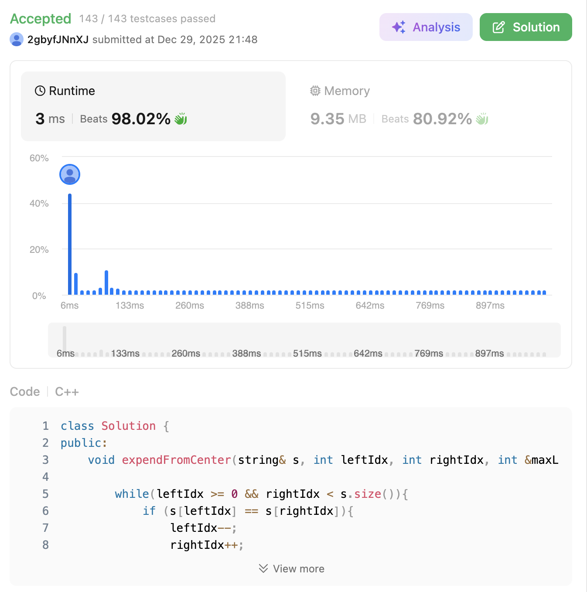

# 5. Longest Palindromic Substring (Medium)

### 題目說明

給定一個字串 `s`，請找到 `s` 中最長的**回文子字串 (Palindromic Substring)**。
（回文的意思是正著讀和反著讀都一樣的字串，例如 "aba" 或 "abba"）。

### 解題邏輯：中心擴展法 (Expand Around Center)

回文最核心的幾何特性就是**「對稱」**。與其窮舉所有子字串再進行驗證（會花費 $O(n^3)$ 的時間），不如**逆向思考**：我們直接站在字串的某個位置當作「中心點」，然後「同時往左和往右擴展」，只要左右兩邊的字元相同，回文的長度就持續增加。

本實作利用了 **Pass by Reference** 技巧，將最佳解的狀態（`start` 與 `maxLen`）傳入輔助函式統一管理：

1. **雙中心點遍歷**：
* 對於字串中的每一個位置 `i`，回文的中心點有兩種可能：
  * **奇數長度**：以 `i` 單一字元為中心（呼叫 `expendFromCenter(s, i, i, ...)`）。
  * **偶數長度**：以 `i` 和 `i + 1` 之間的空隙為中心（呼叫 `expendFromCenter(s, i, i + 1, ...)`）。

2. **向外擴展與狀態更新 (`expendFromCenter`)**：
* 只要指針不越界且左右字元相同 (`s[leftIdx] == s[rightIdx]`)，指針就持續向外擴展 (`leftIdx--`, `rightIdx++`)。
* 當迴圈終止時，`leftIdx` 和 `rightIdx` 已經是不匹配的位置。此時實際的回文邊界是 `leftIdx + 1` 到 `rightIdx - 1`，長度為 `rightIdx - leftIdx - 1`。
* 如果此長度大於歷史最大值 `maxLen`，直接更新全域最佳解的 `start` (`leftIdx + 1`) 與 `maxLen`。

3. **字串截取**：
* 遍歷結束後，利用記錄好的 `start` 和 `maxLen`，透過 `s.substr(start, maxLen)` 一次性截取並回傳結果。

### 複雜度分析

* **時間複雜度**： $O(N^2)$。總共有 $2N - 1$ 個中心點，每個中心點向外擴展最多花費 $O(N)$ 的時間。
* **空間複雜度**： $O(1)$。僅使用常數個變數來維護指標狀態，不消耗額外記憶體。

### 程式碼實作 (C++)

```cpp
class Solution {
public:
    void expendFromCenter(string& s, int leftIdx, int rightIdx, int &maxLen, int& start){

        while(leftIdx >= 0 && rightIdx < s.size()){
            if (s[leftIdx] == s[rightIdx]){
                leftIdx--;
                rightIdx++;
            }
            else{
                break;
            }
        }
        if (rightIdx - leftIdx - 1 > maxLen){
            start = leftIdx + 1;
            maxLen = rightIdx - leftIdx - 1;
        }
    }

    string longestPalindrome(string s) {
        string ans;
        int start = 0, maxLen = 0;

        for(int i = 0; i < s.size(); ++i){
            expendFromCenter(s, i, i, maxLen, start);
            expendFromCenter(s, i, i + 1, maxLen, start);
        }
        return s.substr(start, maxLen);
    }
};
```

