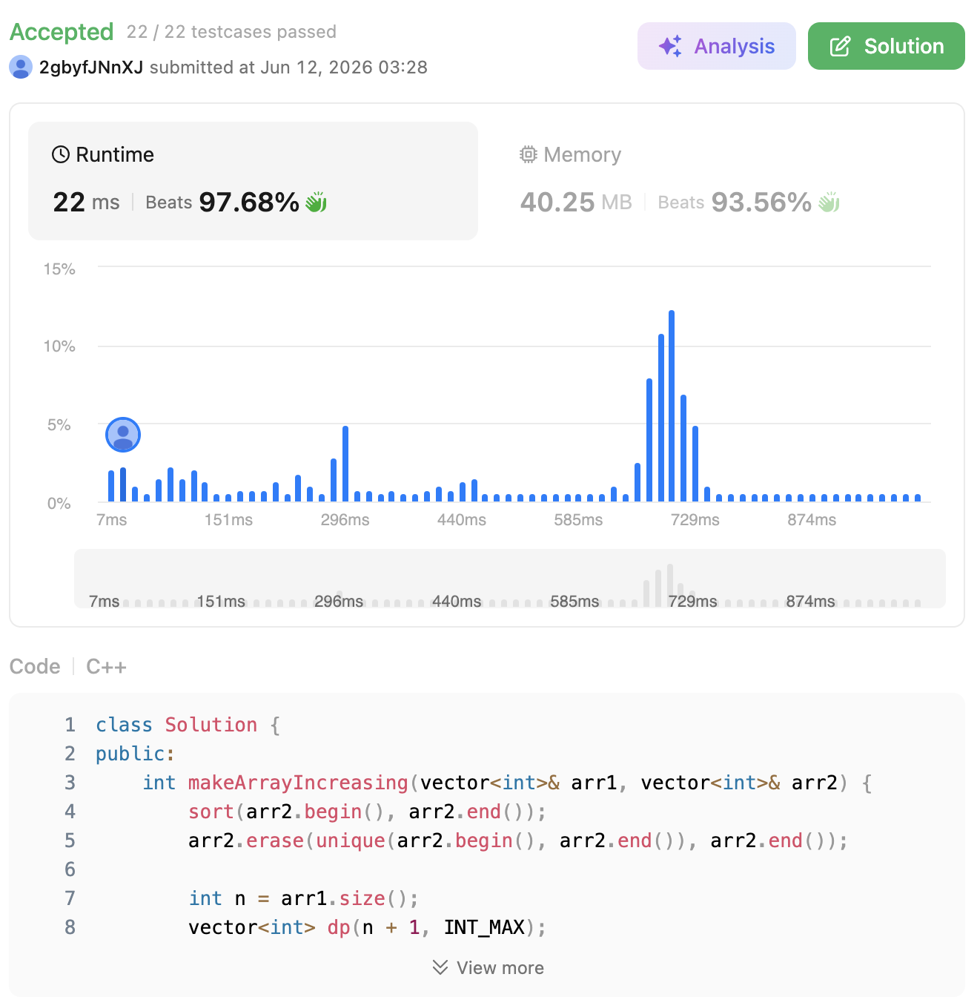

# 1187. Make Array Strictly Increasing (Hard)

### 題目說明

給定兩個整數陣列 `arr1` 和 `arr2`，請回傳讓 `arr1` 變成「嚴格遞增」所需的**最少替換次數**。
每一次操作中，你可以選擇 `arr1` 的任意一個索引，並將其替換為 `arr2` 中的任意一個元素。
如果無論如何都無法讓 `arr1` 變成嚴格遞增，則回傳 `-1`。

### 解題邏輯：滾動 DP + 貪婪最小化尾數 (Greedy Tail Minimization)

這題的核心直覺非常具有啟發性：**「為了解讓後面的數字更容易接上去，我們應該盡可能讓當前的數字『越小越好』。」**
因此，在動態規劃的狀態設計上，我們不以「長度」或「具體數字」作為 DP 的值，而是反過來，把「替換次數」作為狀態的維度，並將「數列的最小結尾值」作為 DP 儲存的目標。

1. **預處理 (Preprocessing)**：
* 對 `arr2` 進行排序並去除重複元素。這樣我們在尋找「大於前一個數字的最小值」時，可以直接利用二分搜尋 (`upper_bound`)，大幅降低時間複雜度。

2. **狀態定義 (State Definition)**：
* 定義 `dp[j]` 為：在處理到 `arr1` 的當前位置時，**正好使用了 `j` 次替換操作**的前提下，所能達成嚴格遞增數列的**「最小結尾數值」**。
* `dp` 陣列初始化為無限大 (`INT_MAX`)。

3. **狀態轉移方程 (State Transition)**：
* 我們逐一掃描 `arr1` 的每個元素 `arr1[i]`，並建立一個全新的 `next_dp` 來記錄推進後的狀態。
* 遍歷前一輪合法的替換次數 `j`，對於每個有效的 `dp[j]`，我們有兩個選擇：
  * **選擇一（不替換）**：如果原生的 `arr1[i] > dp[j]`，代表直接接上去也是嚴格遞增的。更新 `next_dp[j] = min(next_dp[j], arr1[i])`。
  * **選擇二（替換）**：為了讓結尾盡量小，我們去 `arr2` 裡面找**第一個嚴格大於** `dp[j]` 的數字（利用 `upper_bound`）。如果找到了，代表可以花費 1 次替換次數接上這個數字。更新 `next_dp[j + 1] = min(next_dp[j + 1], *it)`。

4. **得出解答**：
* 整個 `arr1` 遍歷完成後，`dp` 陣列中第一個不為無限大的索引 `j`，就是我們能達成目標的最小替換次數。

### 複雜度分析

* **時間複雜度**： $O(N^2 \log M)$。其中 $N$ 是 `arr1` 的長度，$M$ 是去重後 `arr2` 的長度。外層有 $N$ 次迴圈，內層有至多 $N$ 個狀態，每個狀態都需要執行一次 $O(\log M)$ 的 `upper_bound` 二分搜尋。
* **空間複雜度**： $O(N)$。我們使用了滾動陣列（只保留上一輪的 `dp` 與當前的 `next_dp`），陣列長度皆為 $N+1$，極大化了記憶體效益。

### 程式碼實作 (C++)

```cpp
class Solution {
public:
    int makeArrayIncreasing(vector<int>& arr1, vector<int>& arr2) {
        // 1. 預處理：對 arr2 進行排序並去重，以利後續的二分搜尋
        sort(arr2.begin(), arr2.end());
        arr2.erase(unique(arr2.begin(), arr2.end()), arr2.end());
        
        int n = arr1.size();
        // dp[j] 代表在「替換 j 次」的情況下，當前子陣列結尾的「最小值」
        vector<int> dp(n + 1, INT_MAX);
        
        // Base case (i = 0 的情況)
        dp[0] = arr1[0];
        if (!arr2.empty()) {
            dp[1] = arr2[0]; // 換成 arr2 中最小的數字
        }
        
        // 2. 滾動 DP 狀態轉移
        for (int i = 1; i < n; ++i) {
            vector<int> next_dp(n + 1, INT_MAX);
            
            // 截至目前為止，最多可能替換了 i 次
            for (int j = 0; j <= i; ++j) {
                if (dp[j] != INT_MAX) {
                    
                    // 選擇一：不替換 arr1[i] (條件是必須嚴格遞增)
                    if (arr1[i] > dp[j]) {
                        next_dp[j] = min(next_dp[j], arr1[i]);
                    }
                    
                    // 選擇二：替換 arr1[i] (在 arr2 中用二分搜尋尋找第一個大於 dp[j] 的數字)
                    auto it = upper_bound(arr2.begin(), arr2.end(), dp[j]);
                    if (it != arr2.end()) {
                        next_dp[j + 1] = min(next_dp[j + 1], *it);
                    }
                }
            }
            // 滾動更新狀態
            dp = next_dp;
        }
        
        // 3. 找出最小的替換次數 (從 0 找到 n)
        for (int j = 0; j <= n; ++j) {
            if (dp[j] != INT_MAX) {
                return j;
            }
        }
        
        // 無法達成嚴格遞增
        return -1;
    }
};
```

