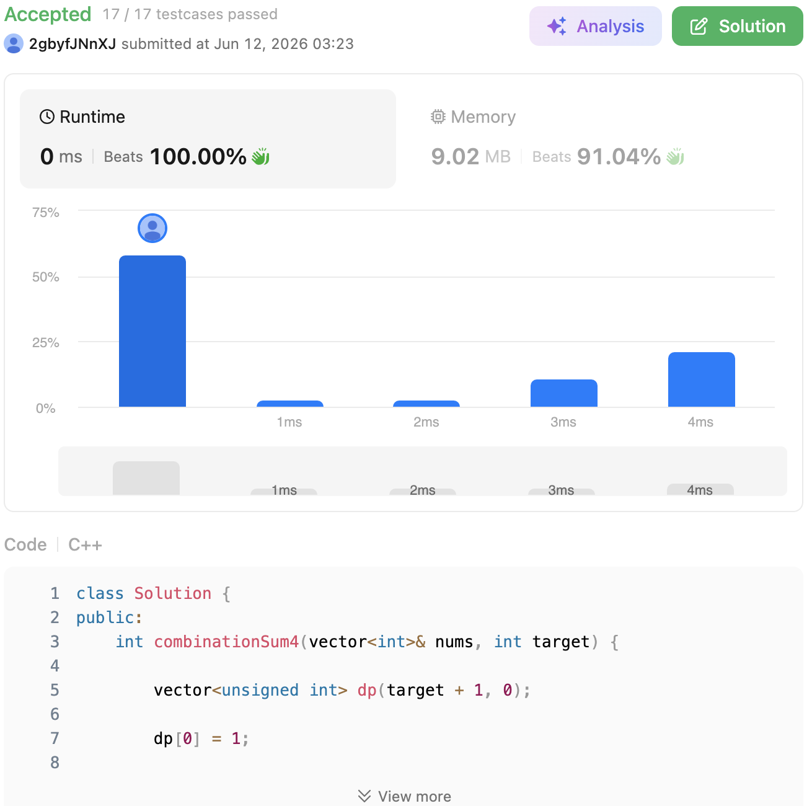

# 377. Combination Sum IV (Medium)

### 題目說明

給定一個由「不同」整數組成的陣列 `nums` 和一個目標整數 `target`。請回傳可以使數字總和等於 `target` 的所有可能組合的個數。
**注意**：順序不同的序列會被視為不同的組合（例如：`(1, 1, 2)` 和 `(1, 2, 1)` 是兩種不同的組合）。這也是這題與傳統「背包問題」或「硬幣找零」最大的不同。

### 解題邏輯：動態規劃 (Dynamic Programming) - 完全背包求排列數

這題雖然名字叫 Combination (組合)，但因為順序不同視為不同結果，本質上是在求**「排列數 (Permutations)」**。
既然求的是總數，而且子問題可以重複利用（例如要湊出 `target=4`，可以從 `target=3` 再加 `1` 轉移過來），非常適合用**動態規劃 (DP)** 來解。

1. **狀態定義 (State Definition)**：
* 定義 `dp[i]` 為：湊成總和為 `i` 的排列組合總數。

2. **狀態轉移方程 (State Transition)**：
* 對於任意總和 `i`，最後一步加上的數字可以是 `nums` 陣列中的任何一個數字 `num`。
* 只要 `i >= num`，那麼湊成總和 `i` 的方法數，就等於「湊成總和 `i - num` 的方法數」的總和。
* 轉移式：`dp[i] = sum(dp[i - num])`，其中 `num ∈ nums` 且 `i >= num`。

3. **邊界條件 (Base Case)**：
* `dp[0] = 1`。湊成總和為 0 的方法只有 1 種，就是什麼數字都不選。（這是所有 DP 累加的基礎點）。
* 實作細節防呆：在 LeetCode 測試資測中，中間的累加過程可能會超過 32-bit signed integer (`int`) 的上限，雖然最終答案保證在 32-bit 內，但在宣告 DP 陣列時，建議使用 `unsigned int` 或 `unsigned long long` 來避免 Overflow (溢位) 報錯。

### 複雜度分析

* **時間複雜度**： $O(\text{target} \times N)$。其中 $N$ 是 `nums` 的長度。我們需要計算從 `1` 到 `target` 的每個狀態，每個狀態都需要遍歷一次長度為 $N$ 的 `nums` 陣列。
* **空間複雜度**： $O(\text{target})$。需要建立一個大小為 `target + 1` 的一維 DP 陣列來儲存狀態。

### 程式碼實作 (C++)

```cpp
class Solution {
public:
    int combinationSum4(vector<int>& nums, int target) {
        // 使用 unsigned int 避免測資中間過程發生 integer overflow
        vector<unsigned int> dp(target + 1, 0);
        
        // Base case: 湊成總和 0 的方法只有 1 種 (什麼都不拿)
        dp[0] = 1;
        
        // 外層迴圈：遍歷每個目標總和 i (從 1 到 target)
        for (int i = 1; i <= target; ++i) {
            // 內層迴圈：遍歷 nums 中的每個數字 num
            for (int num : nums) {
                // 如果當前數字 num 小於等於目標總和 i，代表可以把 num 加到 i-num 的結果上
                if (i >= num) {
                    dp[i] += dp[i - num];
                }
            }
        }
        
        return dp[target];
    }
};
```

