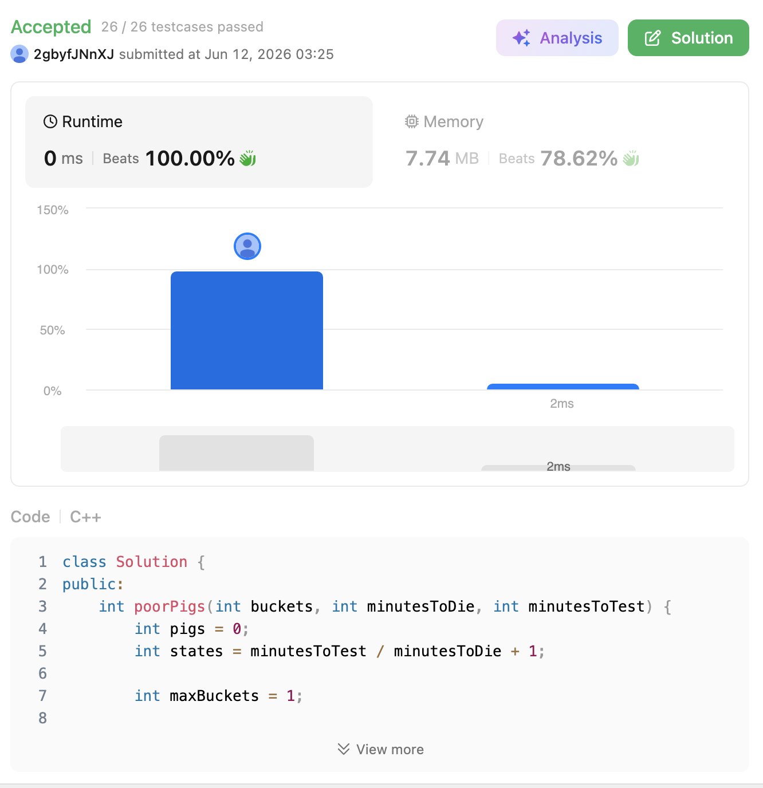

# 458. Poor Pigs (Hard)

### 題目說明

給定 `buckets` 桶液體，其中剛好有「一桶」是有毒的。你有一些可憐的豬可以用來試毒。
豬喝下毒藥後，需要經過 `minutesToDie` 分鐘才會死亡。你總共有 `minutesToTest` 分鐘的時間可以進行測試。
請找出在規定時間內，**最少**需要幾隻豬才能保證找出有毒的那桶液體？

### 解題邏輯：資訊理論與狀態編碼 (Information Theory & State Encoding)

這題看似是演算法題，但本質上是一道極度優美的**「資訊理論 (Information Theory)」與「進位制數學」**問題。我們不需要模擬豬怎麼喝水，而是要計算「豬的生死狀態」能攜帶多少資訊量。

1. **計算單隻豬的狀態數 (Base/Radix)**：
* 一隻豬可以進行幾次測試？ `rounds = minutesToTest / minutesToDie`。
* 經過 `rounds` 次測試後，一隻豬會有幾種可能的結局（狀態）？
  * 第 1 輪喝死
  * 第 2 輪喝死
  * ...
  * 第 `rounds` 輪喝死
  * 到最後都沒死（活下來）
* 因此，一隻豬總共能提供 **`rounds + 1` 種狀態**（我們可以將其視為進位制的「底數 Base」或 `states`）。

2. **多隻豬的狀態組合**：
* 如果我們有 `pigs` 隻豬，每隻豬都有 `states` 種狀態，那麼這些豬的生死組合總共可以表示 **`states^pigs`** 種不同的結果。
* 為了要能精確找出哪一桶是有毒的，豬的狀態組合總數必須**大於或等於**水桶的總數：
  $$(\text{rounds} + 1)^{\text{pigs}} \ge \text{buckets}$$

3. **實作細節防呆**：
* 雖然數學上 `pigs >= log(buckets) / log(states)`，但在 C++ 中直接使用 `log()` 或 `ceil()` 處理浮點數除法時，極容易遇到精度誤差（Precision Issue）導致 WA（例如 `log(125)/log(5)` 可能是 `2.999999` 導致進位錯誤）。
* **最穩健的做法**是用一個 `while` 迴圈，利用整數相乘來模擬指數增長，直到累積的狀態數大於等於 `buckets`。

### 複雜度分析

* **時間複雜度**： $O(\log_{\text{states}} (\text{buckets}))$。因為 `pigs` 的數量極小，整數相乘的迴圈次數也就是對數量級，幾乎等同於 $O(1)$ 的執行時間。
* **空間複雜度**： $O(1)$。僅使用常數個變數。

### 程式碼實作 (C++)

```cpp
class Solution {
public:
    int poorPigs(int buckets, int minutesToDie, int minutesToTest) {
        int pigs = 0;
        // 計算一隻豬能有幾種狀態 (測試輪數 + 1)
        int states = minutesToTest / minutesToDie + 1;
        
        int maxBuckets = 1; // 當前 pigs 隻豬能測出的最大水桶數
        
        // 使用整數連乘，避免浮點數 log 帶來的精度誤差
        while (maxBuckets < buckets) {
            maxBuckets *= states;
            pigs++;
        }
        
        return pigs;
    }
};
```

